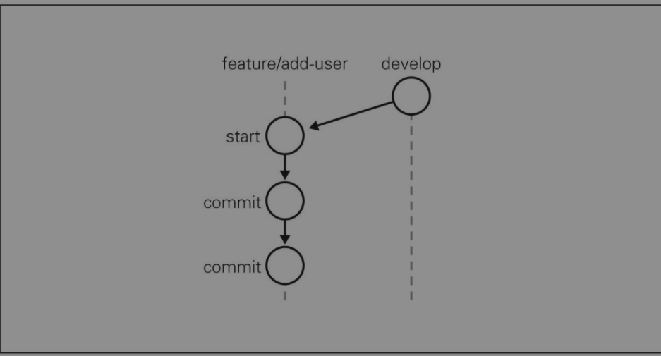
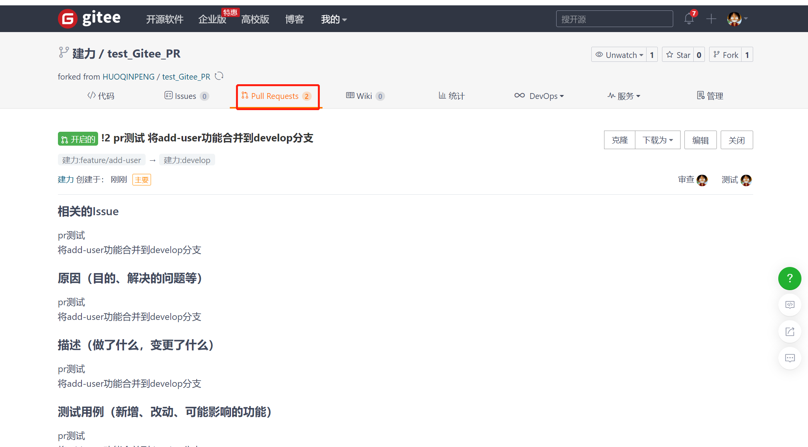
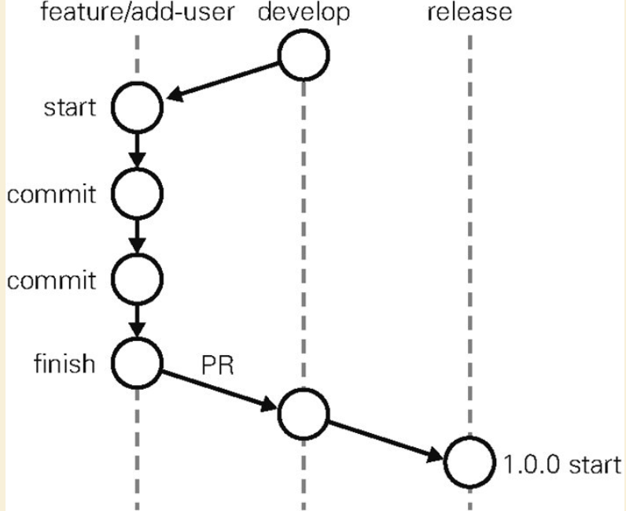
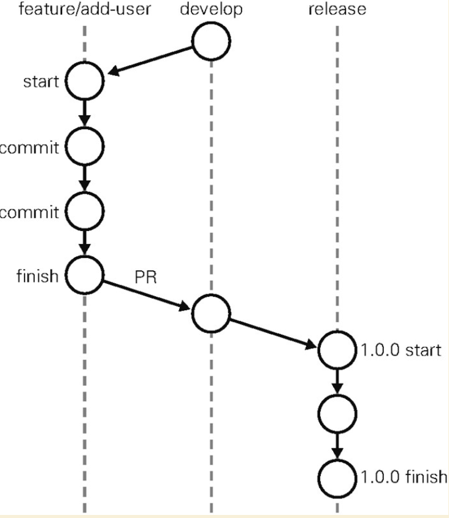
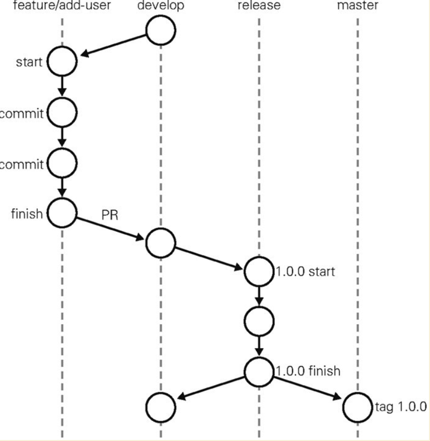
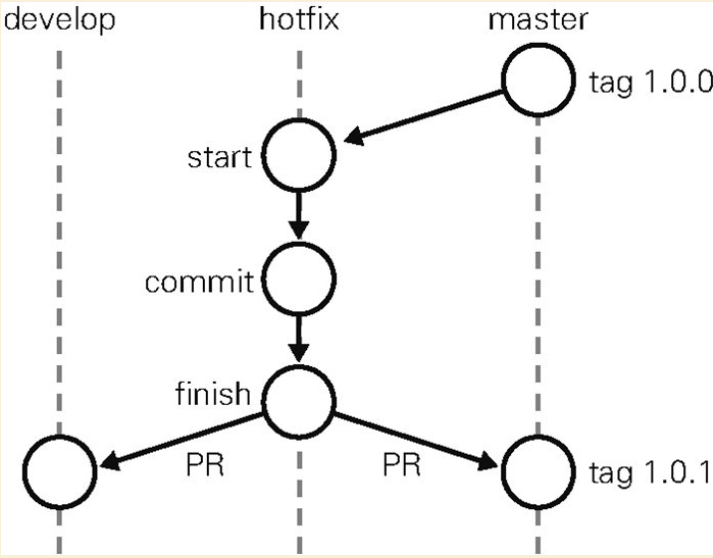

# 便于理解的标准流程

从软件开发者的角度观察这一开发流程时会发现，该流程用分支名表示标准软件开发中开发状态的迁移。

```
❶ 从开发版的分支（develop）创建工作分支（feature branches），进行功能的实现或修正

❷ 工作分支（feature branches）的修改结束后，与开发版的分支（develop）进行合并

❸ 重复上述❶和❷，不断实现功能直至可以发布

❹ 创建用于发布的分支（release branches），处理发布的各项工作

❺ 发布工作完成后与master分支合并，打上版本标签（Tag）进行发布

❻ 如果发布的软件出现BUG，以打了标签的版本为基础进行修正（hotfixes）
```

在这个流程中，程序员必须理解自己正在进行的修改会对哪些分支产生影响。一个分支的工作结束后，有时需要与多个目标分支合并。这些是该流程中最为复杂的部分，需要团队谨慎处理。同时由于其复杂程度高，容易出现操作失误等人为错误。所以团队需要使用`git-flow`等工具进行辅助，时刻保证开发不偏离流程。


## 模拟体验Git Flow


### 1.创建分支(前期工作)

#### **1.1 进行 git flow 的初始设置**

下面我们为 git flow 进行初始设置。由于我们不打算更改默认值，所以在命令后附上 `- d` 参数。执行以下命令后，仓库中会自动生成开发流程所需的分支。各位在执行 `git clone` 后请务必记得执行一次这个命令。

```shell
$ git flow init -d
```

查看已创建的分支。

```shell
$ git branch -a
* develop
  master
  remotes/origin/HEAD -> origin/master
  remotes/origin/hujianli_dev
  remotes/origin/master
```

#### **1.2 在远程仓库中也创建 develop 分支**

目前我们在本地环境中拥有 master 和 develop 两个分支，但是 GitHub 端的远程仓库 中仍然只有 master 分支。所以我们进行 push 操作，在 GitHub 端的远程仓库中也创建一个 develop 分支。

```shell
$ git push -u origin develop
Total 0 (delta 0), reused 0 (delta 0)
```

现在 GitHub 端的仓库中也有了 develop 分支。

------

**今后团队会以 GitHub 端的 develop 分支作为开发中的最新代码，包括我们在内的所有团队成员都要以这个分支为基础进行开发。**

## 实践 Git Flow

### **1. master分支与develop分支的区别**

##### master分支

master分支时常保持着软件可以正常运行的状态。由于要维持这一状态，所以不允许开发者直接对master分支的代码进行修改和提交

##### develop分支

develop分支是开发过程中的代码中心分支。与master分支一样，这个分支也不允许开发者直接进行修改和提交。

程序员要以develop分支为起点新建feature分支，在feature分支中进行新功能的开发或者代码的修正。也就是说，develop分支维持着开发过程中的最新源代码，以便程序员创建feature分支进行自己的工作。

**在feature中进行的工作**

feature分支以develop分支为起点，是开发者直接更改代码发送提交的分支。

开发以下述流程进行。

```
❶ 从develop分支创建feature分支
❷ 在feature分支中实现目标功能
❸ 通过GitHub向develop分支发送Pull Request
❹ 接受其他开发者审查后，将Pull Request合并至develop分支
```

与develop分支合并后，已经完成工作的feature分支就失去了作用，可以在适当的时候删除。


### **2. 创建分支**

首先要将develop分支更新至最新状态。我们从 GitHub 的远程仓库进行 pull 操作。这一操作要在 develop 分支下进行。

```shell
$ git pull
```

创建feature分支add-user，用来实现添加用户的功能。

```shell
$ git flow feature start add-user
```

我们已经创建并切换到了feature/add-user分支。保险起见，让我们来确认一下。

```shell
$ git branch -a
  develop
* feature/add-user
```

### **3.在分支中进行作业**

接下来在刚刚创建的feature/add-user分支中实现目标功能并进行提交。

```shell
// 写代码 ，修复bug

$ git commit -am "git flow add user..."

$ git diff
```





### **4.发送Pull Request**

首先我们将 feature/add-user 分支 push 到 GitHub 端远程仓库。

```shell
$ git push origin feature/add-user
Total 0 (delta 0), reused 0 (delta 0)
remote: Powered by GITEE.COM [GNK-5.0]
remote: Create a pull request for 'feature/add-user' on Gitee by visiting:
remote:     https://gitee.com/hujianli94net/test_-gitee_-pr/pull/new/hujianli94net:feature/add-user...hujianli94net:master
To https://gitee.com/hujianli94net/test_-gitee_-pr.git
 * [new branch]      feature/add-user -> feature/add-user
```

然后发送Pull Request之后




### **5.通过代码审查提高代码质量**

发送 Pull Request 之后，通过下列步骤利用 Pull Request 从其他开发者那里获取反馈，不断精炼代码。

```
❶ 由其他开发者进行代码审查，在 Pull Request 中提供反馈

❷ 修正代码以反映反馈内容（在本地 feature/add-user 分支中）

❸ 将 feature/add-user 分支 push 到远程仓库（自动添加至之前的 Pull Request）

❹ 重复前三步

❺ 确认 Pull Request 没有问题后，由其他开发者将其合并至 develop 分支
```


### **6.更新本地的 develop 分支**

我们发送的 Pull Request 在 GitHub 端与 develop 合并后，为让其反映到本地的 develop 分支中，我们需要进行以下操作。

- 切换至 develop 分支
- 执行 git pull（fetch & merge）

这样一来，本地 develop 分支就从 GitHub 端仓库获取了最新状态。

```shell
$ git checkout develop
```

每当需要从 develop 分支创建 feature 等分支时，记得一定要先执行上述操作，保证 develop 分支处于最新状态。

在实际开发中，我们会不断重复之前这一系列流程，不断为 develop 分支添加功能。当功能积攒到足以发布时，就会用到 release 分支。

### **7.在 release 分支中进行的工作**

#### 7.1 **创建分支**

我们从最新的 develop 分支着手，开始 1.0.0 版本的 release 工作。

```shell
切换至develop分支
$ git checkout develop
Switched to branch 'develop'
        　
获取最新develop分支的代码
$ git pull
Already up-to-date.
        　
开始release分支
$ git flow release start '1.0.0'
Switched to a new branch 'release/1.0.0'
        　
Summary of actions:
- A new branch 'release/1.0.0' was created, based on 'develop'
- You are now on branch 'release/1.0.0'
        　
Follow-up actions:
- Bump the version number now!
- Start committing last-minute fixes in preparing your release
- When done, run:
        　
     git flow release finish '1.0.0'
```

```shell
$ git branch -a
  develop
  feature/add-user
  master
* release/1.0.0
```


release/1.0.0 分支已经成功创建，它就是这次的 release 分支



#### **7.2 分支内的工作**

在这个分支中，我们只处理与发布前准备相关的提交。比如版本编号变更等元数据的添加工作。如果软件部署到预演环境后经测试发现 BUG，相关的修正也要提交给这个分支。但要记住，该分支中绝对不可以包含需求变更或功能变更等重大修正。这一阶段的提交数应该限制到最低.

又开始码代码

```
//coding.......
```

#### **7.3 进行发布与合并**

```shell
$ git commit -am "release pull ...1.0.0"
[release/1.0.0 7a5b709] release pull ...1.0.0
 1 file changed, 9 insertions(+)

$ git push origin release/1.0.0

//发布前的修正全部处理完后，我们结束这一分支。
$ git flow release finish '1.0.0'
```

当前状态如下：



**release finish 之后**

release 分支将合并至 master 分支。分支在合并时会询问提交信息，如果没有需要特别声明的事项，可以直接保持默认状态。

```
Merge branch 'release/1.0.0'
```

接下来，合并后的 master 分支会加入一个与版本号相同编号的标签。

```
Release 1.0.0
#
```

当前状态如图


全部工作结束后，会显示如下字样。

```shell
$ git flow release finish '1.0.0'
```

当前的状态如下图

**release 分支合并到 develop 分支后的状态**



#### **7.4 查看版本标签**

通过前面一系列操作，我们创建了与发布版本号相同的 Git 标签。

```shell
$ git tag
1.0.0
```

今后如果遇到什么问题，只要指定这个标签，就可以将软件回溯到相应版本。

### **8.更新到远程仓库**

至此我们对多个分支进行了修改，所以需要利用 push 操作将修改更新到 GitHub 端的远程仓库。我们先从 develop 分支开始。

```shell
$ git branch -a
* develop
  feature/add-user
  master
  remotes/origin/HEAD -> origin/master
  remotes/origin/develop
  remotes/origin/feature/add-user
  remotes/origin/hujianli_dev
  remotes/origin/master

$ git push origin develop
```

然后是 master 分支。

```shell
$ git checkout master
Switched to branch 'master'
Your branch is ahead of 'origin/master' by 5 commits.
  (use "git push" to publish your local commits)
    　
$ git push origin master
```

再 push 标签信息。

```shell
$ git push --tags
```

版本号 1.0.0 的标签信息已经 push 完毕，现在只要发布 master 分支，整个发布工作就结束了。

### **9.在 hotfix 分支中进行的工作**

hotfix 分支并不是预期中计划出现的分支。它是一个紧急应对措施，只有当前发布的版本中出现 BUG 或漏洞，而且其严重程度要求开发方必须立刻处理，无法等到下一个版本发布时，hotfix 分支才会被创建。

该分支迁移过程的示意图。



有待补充..........。


## Git Flow的小结

这一开发流程在软件开发世界中存在已久，并没有什么太新颖的地方。但也正因如此，它更容易为软件开发者所理解。但是，由于在实际开发现场需要多人分工合作，这一开发流程往往会变得很复杂。

**建议各位把开发流程图放大并张贴在墙壁上，这样能够有效帮助团队成员理解流程内容。**


版本控制策略规定了软件版本号的分配规则，因此制定该策略时应当尽量简单易懂。

比如在用x.y.z格式进行版本管理时的规则如下所示。

```
● x在重大功能变更或新版本不向下兼容时加1，此时y与z的数字归0

●y在添加新功能或者删除已有功能时加1，此时z的数字归0

●z只在进行内部修改后加1
```

下面举个具体例子。

```
●1.0.0：最初发布的版本
●1.0.1：修正了轻微BUG
●1.0.2：修复漏洞
●1.1.0：添加新功能
●2.0.0：更新整体UI并添加新功能
```


## 能实现Git托管的软件

有一些开源软件拥有与GitHub相类似的功能。例如下面几种都比较常用。

```
●GitBucket
●GitLab
●Gitorious
●RhodeCode
```

这类软件都有自己的UI，所以在熟悉操作时需要花费一些学习成本。

另外，在运用方面虽然省去了购买的开销，但软件终究无法提供GitHub的所有便捷服务，导致开发者在开发过程中需要时常注意其与GitHub的不同之处。因此，如果要追求效率，还是建议选择GitHub。


