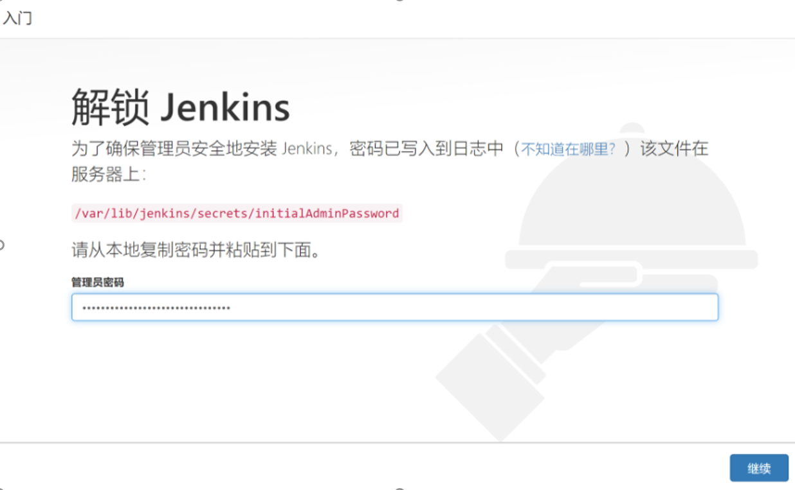
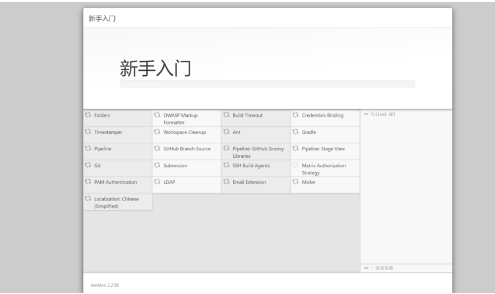
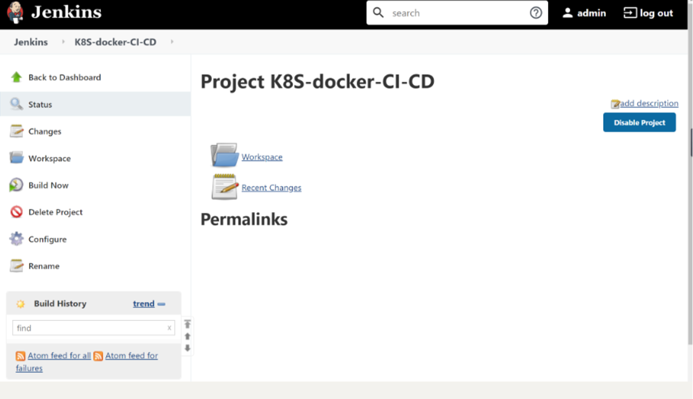
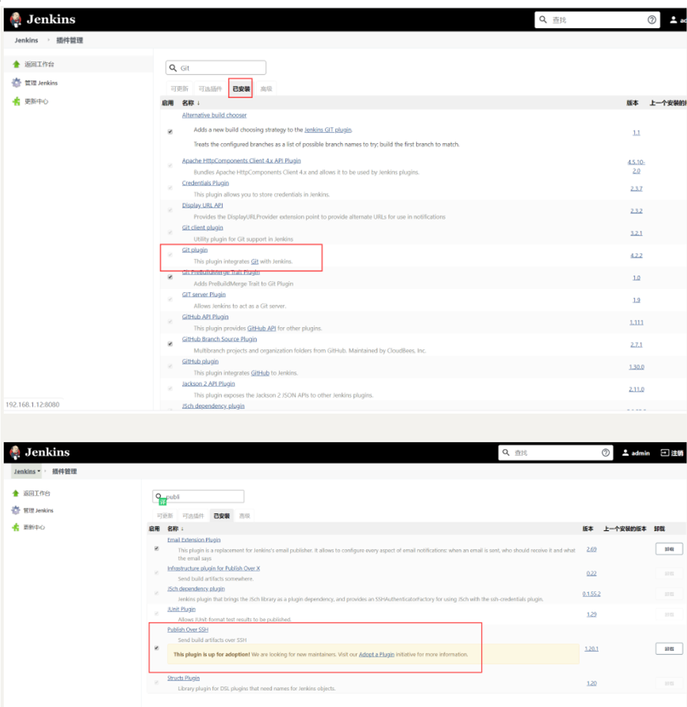
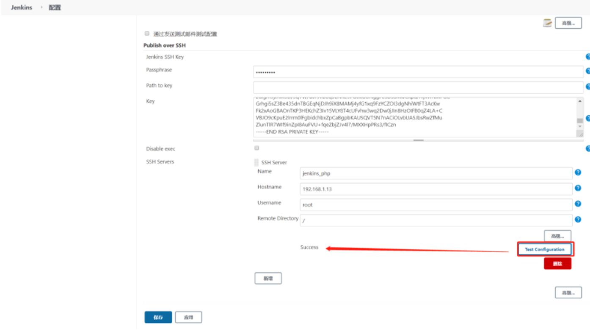
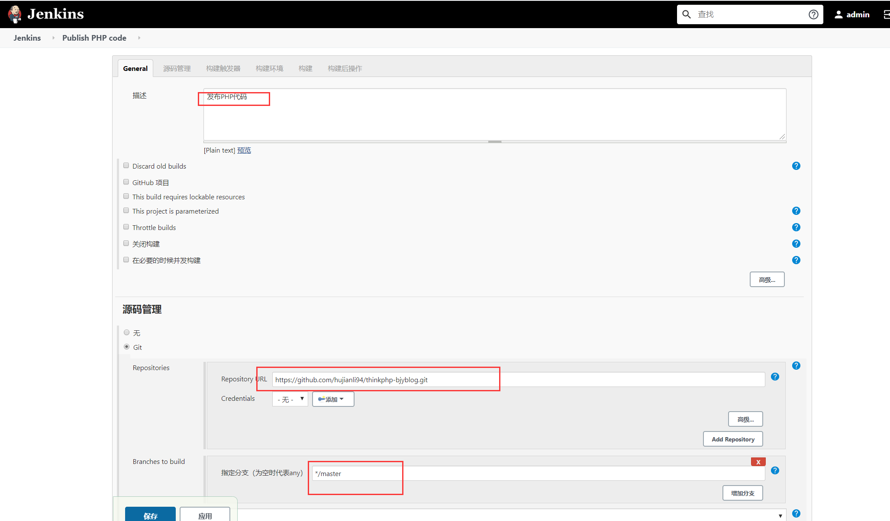
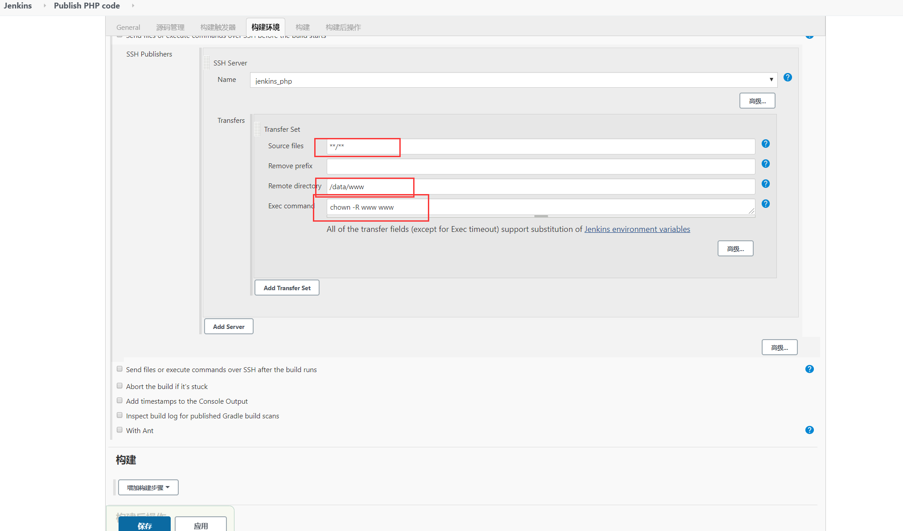
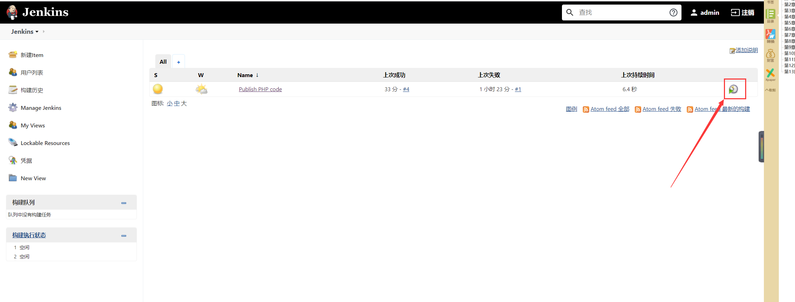

# Jenkins持续化集成

## Jenkins安装

安装Jenkins需要安装JDK，JDK版本必须高于或等于1.8，可以使用源码包安装JDK，也可以使用yum命令安装openjdk，此处使用yum命令安装openjdk，命令如下:

```shell
yum install -y java-1.8.0-openjdk
```

​		安装Jenkins工具的yum源，设置好yum源后使用rpm命令安装Jenkins的key，因为在Jenkins的yum源配置文件中gpgcheck=1，所以需要验证Jenkins的key，命令如下：

```shell
[root@bogon ~]# wget -O /etc/yum.repos.d/jenkins.repo https://pkg.jenkins.io/redhat/jenkins.repo

[root@bogon ~]# ls /etc/yum.repos.d/jenkins.repo 
/etc/yum.repos.d/jenkins.repo
[root@bogon ~]# rpm --import https://pkg.jenkins.io/redhat/jenkins.io.key

```

使用yum命令安装jenkins，安装后启动Jenkins服务，命令如下：

```shell
[root@bogon ~]# yum -y install jenkins
[root@bogon ~]# systemctl start jenkins
[root@bogon ~]# ps aux | grep jenkins
[root@bogon ~]# netstat -lntp|grep 8080
tcp6       0      0 :::8080                 :::*                    LISTEN      15126/java  
```

Jenkins的日志文件是`/var/log/jenkins/jenkins.log`,通过该日志文件可查看admin密码。也可以到`/var/lib/jenkins/secrets/initialAdminPassword`文件中查看该密码,命令如下：

```shell
[root@bogon ~]# less /var/log/jenkins/jenkins.log |grep -A5 password
Jenkins initial setup is required. An admin user has been created and a password generated.
Please use the following password to proceed to installation:

9de71bec5b21497da790a88da5f0fa4c

This may also be found at: /var/lib/jenkins/secrets/initialAdminPassword

```

打开浏览器，在地址栏中输入IP和Port进行Jenkins的安装。



单击“ 继续” 按钮选择要安装的插件， 默认安装官方提供的插件， 无需自定义。
插件安装完成后要求设置管理员账号和密码， 与搭建开源Web 网站一样。安装完成后会看到如图所示的Jenkins 后台管理界面。



在/etc/sysconfig目录下有一个jenkins文件，该文件是Jenkins的配置文件，

命令如下：

```shell
[root@bogon ~]# ls /etc/sysconfig/jenkins 
/etc/sysconfig/jenkins
```

Jenkins 程序主目录在/var/lib/jenkins/目录下， jobs 目录下存放的是在Jenkins 浏
览器界面中创建的任务。例如， 在Jenkins 后台web 界面中创建一个“ k8s-docker-CI-CD” 的任务， 在_iobs 目录下就会生成一个“k8s-docker-CI-CD”的目录，命令如下。




```shell
[root@bogon ~]# ls /var/lib/jenkins/jobs/
k8s-docker-CI-CD

[root@bogon ~]# ls /var/lib/jenkins/jobs/k8s-docker-CI-CD/
builds  config.xml
```

logs目录时Jenkins日志相关的目录；nodes是多节点时用到的目录，plugins是Jenkins插件所在的目录，该目录下有很多插件，如新建一个插件，插件会自动保存在该目录下，命令如下：

```shell
[root@bogon ~]# ls /var/lib/jenkins/logs/
tasks
[root@bogon ~]# ls /var/lib/jenkins/nodes
[root@bogon ~]# ls /var/lib/jenkins/plugins/
```

secrets是Jenkins密码、密钥存放的目录，users是与用户相关的目录，命令如下：

```shell
[root@bogon ~]# ls /var/lib/jenkins/users/
admin_6215967324725742951  users.xml
```

如果需要备份Jenkins，直接把/var/lib/jenkins目录下的文件或目录打包到新服务器上即可，Jenkins无需借助数据库存储数据，它的配置全部存放在XML格式文件中。


参考文献

[Centos7安装jenkins](https://www.cnblogs.com/xiao987334176/p/13032339.html)

[CentOS7搭建jenkins](https://www.cnblogs.com/xiao987334176/p/11903724.html)

[ubuntu 安装Jenkins](https://www.cnblogs.com/xiao987334176/p/11323795.html)


## Jenkins发布PHP代码

打开Jenkins后台Web界面，选择“系统管理”->"管理插件"->"已安装"，检查
检查是否有`Git plugin` 和`Publish Over SSH `两个插件。如果没有， 则需要单击“ 可选插件” 按钮进行安装。安装后重启Jenkins 服务， 命令如下。重启Jenkins 后需要重新在Web 界面中进行登录。

```shell
$ systemctl restart jenkins.service	
```





生成一对密钥用来远程登录服务器，然后将公钥追加到远程服务器的/root/.ssh/authorized_keys文件中，命令如下：

```shell
 ssh-keygen -t rsa
 
 rm -rf ~/.ssh/config
 
 ssh-copy-id -i /root/.ssh/id_rsa.pub root@192.168.1.13

```

安装好两个插件后，选择“系统管理”->“系统设置”，在界面底部选择Publish Over SSH 插件进行相关设置，如图：


**注意**

```
在Passphrase 文本框中输入密码，

Pathto key留空,在key文本框中粘贴/root/.ssh/jenkins文件中的内容。

单击左下角的“增加”按钮增加SSH Server,name可自定义,
在Hostname文本框中输入线上Web服务器IP,在Username 文本框中输入root,在Remote Directory 文本框中输入“/”（根） 。

如果是多台Web Server,继续单击"添加"按钮重复上述操作即可。操作完毕后单击Apply按钮或“保存"按钮。
```

设置完插件后创建新任务，任务名可自定义，如Publish PHP code，选择构建一个自由风格的软件项目，最后单击“确定”按钮进入下一页，在“描述”文本框中输入“发布PHP代码（自定义即可）”，在“源码管理“页面可根据个人或公司情况选择Git或SVN，此处选择Git作为演示。如图：



“构建触发器”和“构建环境”处留空，不做任何选择，增加构建步骤Send files or execute commands over SSH，设置如图：



**注意**

```
在Transfer Set Source files 文本框中输入“ **／**”,表示全部文件。

在Removeprefix 文本框中可以指定截掉的前缀目录，这里留空即可。

Remote directory 用于指定远程服务器上代码的存放路径，例如/data/www/thinkphp.com 。

Exec command为文件传输完成后要执行的命令,例如可以是更改文件权限的命令。

设置完成后单击"Add Transfer Set ”按钮；

如果是多台服务器，可以单击“ Add Server ” 按钮重复以上操作。
```


单击Publish PHP code进行项目构建，如图：




构建后到远程服务器中查看设置的目录，如/data/www目录下回生成复制的源码文件。命令如下：

```shell
[root@desktop-pmjtngi www]# ll /data/www/
total 44
drwxr-xr-x. 2 root root    23 Jun  1 10:54 admin
drwxr-xr-x. 6 root root    91 Jun  1 10:54 Application
-rw-r--r--. 1 root root   404 Jun  1 11:23 composer.json
-rw-r--r--. 1 root root  5558 Jun  1 11:23 favicon.ico
-rw-r--r--. 1 root root  2282 Jun  1 11:23 gulpfile.js
-rw-r--r--. 1 root root  1595 Jun  1 11:23 index.php
-rw-r--r--. 1 root root 10254 Jun  1 11:23 LICENSE
-rw-r--r--. 1 root root   854 Jun  1 11:23 package.json
drwxr-xr-x. 5 root root    83 Jun  1 10:54 Public
-rw-r--r--. 1 root root  2751 Jun  1 11:23 README.md
-rw-r--r--. 1 root root    66 Jun  1 11:23 robots.txt
drwxr-xr-x. 4 root root    58 Jun  1 10:54 Template
drwxr-xr-x. 8 root root   154 Jun  1 10:54 ThinkPHP
drwxr-xr-x. 3 root root    37 Jun  1 10:54 Upload


root@desktop-pmjtngi www]# cat README.md 
[创建 QQ 群及捐赠渠道](https://baijunyao.com/article/124)  


## 链接
- 博客：http://baijunyao.com  
- github：https://github.com/baijunyao/thinkphp-bjyblog  
- gitee：https://gitee.com/baijunyao/thinkbjy  
......
```

在本地修改完代码，提交到Github上，然后在Jenkins中重新构建此项目，那么代码就自动在服务器上更新了。


## 基于docker搭建jenkins

[基于docker搭建jenkins](https://www.cnblogs.com/xiao987334176/p/13373198.html)


### Jenkins插件下载镜像加速

参考文献：

https://www.cnblogs.com/cfsxgogogo/archive/2004/01/13/12613211.html

https://blog.51cto.com/liujingyu/2529565


```
更换地址
点击 jenkins 的系统管理 --> 插件管理，打开插件管理页面，如图：
Jenkins 欢迎页面点击系统管理，进入系统管理页面，并点击插件管理进入到插件管理页面，如下图：
在插件管理页面点击高级（Advanced），如下图：
在高级选项卡找到更新网站（Update Site）菜单项，将默认网站更新为 https://mirrors.tuna.tsinghua.edu.cn/jenkins/updates/update-center.json 
 
重启Jenkins
```

修改Jenkins的插件下载地址

```
#文件路径
ls /var/jenkins_home/updates/default.json  

进入updates目录下,执行 命令
# sed -i 's/http:\/\/updates.jenkins-ci.org\/download/https:\/\/mirrors.tuna.tsinghua.edu.cn\/jenkins/g' default.json && sed -i 's/http:\/\/www.google.com/https:\/\/www.baidu.com/g' default.json
```


推荐清华大学镜像：https://mirrors.tuna.tsinghua.edu.cn/jenkins/updates/update-center.json

修改文件

```
vi /data/jenkins/data/hudson.model.UpdateCenter.xml
```

完整内容如下：

```
<?xml version='1.1' encoding='UTF-8'?>
<sites>
  <site>
    <id>default</id>
    <url>https://mirrors.tuna.tsinghua.edu.cn/jenkins/updates/update-center.json</url>
  </site>
</sites>
```

重启jenkins

```
docker restart jenkins
```


## Jenkins+Gitlab配置Webhook实现提交自动部署

参考文献
https://www.cnblogs.com/xiao987334176/p/11443002.html


## GitLab+Jenkins持续集成
参考文献
https://www.cnblogs.com/xiao987334176/p/11425560.html


## jenkins pipeline持续集成
### pipeline基本使用


参考文献

https://www.cnblogs.com/xiao987334176/p/12427209.html

### pipeline语法


参考文献

https://www.jenkins.io/doc/book/pipeline/syntax/


https://www.bookstack.cn/read/jenkins/a80f4d0e840c74f2.md


https://www.ssgeek.com/post/jenkinspipeline-yu-fa-gai-yao/


## golang+jenkins自动化部署方案

参考文献

https://www.jianshu.com/p/e81084d3756d


## 相关参考文献

<https://www.cnblogs.com/opesn/p/11794465.html>

