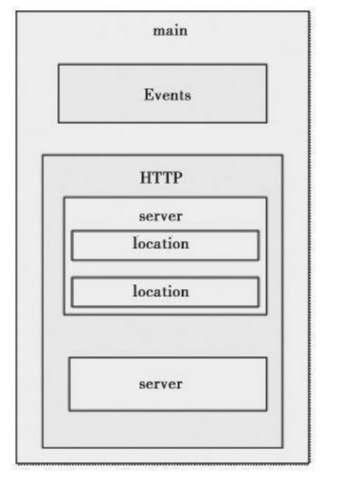
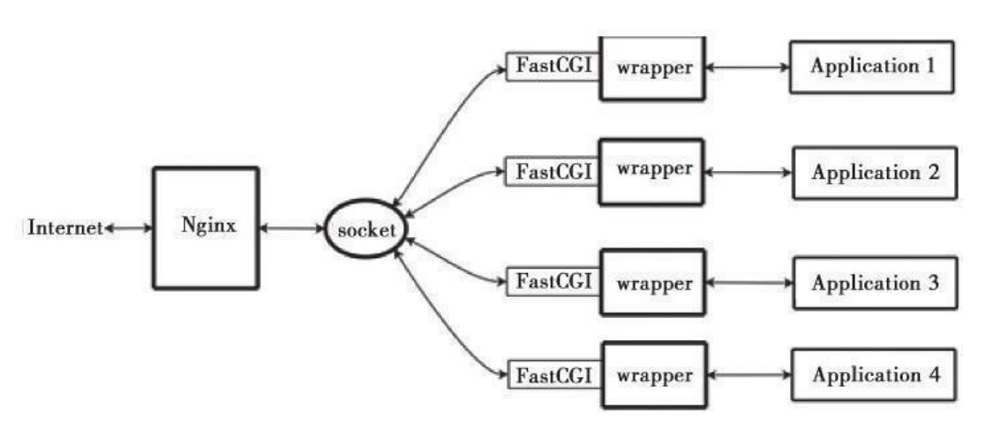

# 01.轻量级HTTP服务器Nginx

Nginx与Apache相比有以下优势：在性能上，它占用很少的系统资源，
能支持更多的并发连接，达到更高的访问效率；在功能上，Nginx是优秀的代理服务器和负载均衡服务器；在安装配置上，Nginx安装简单、配置灵活。

## Nginx与Apache的异同

Nginx和Apache一样，都是HTTP服务器软件，在功能实现上都采用模块化结构设计，都支持通用的语言接口，如PHP、Perl、Python等，同时还支持正向和反向代
理、虚拟主机、URL重写、压缩传输、SSL加密传输等。
它们之间最大的差别是
```
Apache的处理速度很慢，且占用很多内存资源，而Nginx却恰恰相反；

* 在功能实现上，Apache的所有模块都支持动、静态编译，而Nginx模块都是静态编译的，同
时，Apache对Fcgi的支持不好，而Nginx对Fcgi的支持非常好；

* 在处理连接方式上，Nginx支持epoll，而Apache却不支持；

* 在空间使用上，Nginx安装包仅仅只有几百K，和Nginx比起来Apache绝对是庞然大物。


```
在了解了Nginx和Apache之间的异同点后基本上就知道了Nginx作为HTTP服务器的优势所在。

## Nginx的优势所在
``` 
* 作为Web服务器，Nginx处理静态文件、索引文件，自动索引的效率非常高。

* 作为代理服务器，Nginx可以实现无缓存的反向代理加速，提高网站运行速度。

* 作为负载均衡服务器，Nginx既可以在内部直接支持Rails和PHP，也可以支持HTTP代理服务器对外进行服务，同时还支持简单的容错和利用算法进行负载均衡。
在性能方面，Nginx是专门为性能优化而开发的，在实现上非常注重效率。它采用内核Poll模型，可以支持更多的并发连接，最大可以支持对50000个并发连接数的响应，而且只占用很低的内存资源。

* 在稳定性方面，Nginx采取了分阶段资源分配技术，使得CPU与内存的占用率非常低。Nginx官方表示，Nginx保持10000个没有活动的连接，而这些连接只占用
2.5MB内存，因此，类似DOS这样的攻击对Nginx来说基本上是没有任何作用的。

* 在高可用性方面，Nginx支持热部署，启动速度特别迅速，因此可以在不间断服务的情况下，对软件版本或者配置进行升级，即使运行数月也无需重新启动，几乎可以
做到7×24小时不间断地运行。
```

## Nginx的模块与工作原理
Nginx由内核和模块组成，其中，内核的设计非常微小和简洁，完成的工作也非常简单，仅仅通过查找配置文件将客户端请求映射到一个location block(location
是Nginx配置中的一个指令，用于URL匹配)，而在这个location中所配置的每个指
令将会启动不同的模块去完成相应的工作。


Nginx的模块从结构上分为`核心模块`、`基础模块`和`第三方模块`，
```
HTTP模块、EVENT模块和MAIL模块等属于核心模块，

HTTP Access模块、HTTP FastCGI模块、HTTPProxy模块和HTTP Rewrite模块属于基础模块，

而HTTP Upstream Request Hash模块、Notice模块和HTTP Access Key模块属于第三方模块，
```

用户根据自己的需要开发的模块都属于第三方模块。正是有了这么多模块的支撑，Nginx的功能才会如此
强大。

Nginx的模块从功能上分为如下三类。
``` 
Handlers(处理器模块)。此类模块直接处理请求，并进行输出内容和修改headers信息等操作。Handlers处理器模块一般只能有一个。


Filters(过滤器模块)。此类模块主要对其他处理器模块输出的内容进行修改操作，最后由Nginx输出。

Proxies(代理类模块)。此类模块是Nginx的HTTP Upstream之类的模块，这些模块主要与后端一些服务比如FastCGI等进行交互，实现服务代理和负载均衡等功能
```

Nginx模块常规的HTTP请求和响应的过程如下图所示：


在工作方式上，Nginx分为`单工作进程`和`多工作进程`两种模式。
```
在单工作进程模式下，除主进程外，还有一个工作进程，工作进程是单线程的；

在多工作进程模式下，每个工作进程包含多个线程。
```

Nginx默认为单工作进程模式。Nginx的模块直接被编译进Nginx，因此属于静态编译方式。启动Nginx后，Nginx
的模块被自动加载，不像Apache，首先将模块编译为一个so文件，然后在配置文件中指定是否进行加载。在解析配置文件时，Nginx的每个模块都有可能去处理某个请
求，但是同一个处理请求只能由一个模块来完成。


## Nginx的安装与配置
Nginx的官方网站是http://sysoev.ru/nginx/，英文主页为http：//nginx.net，从这里可以获得Nginx的最新版本信息。

Nginx有三个版本：
稳定版、开发版和历史稳定版。开发版更新较快，包含最新的功能和bug的修复，但
同时也可能会出现新的bug。开发版一旦更新稳定下来，就会被加入稳定版分支中。
然而有些新功能不一定会被加到稳定版中去。稳定版更新较慢，但是bug较少，可以作为生产环境的首选，因此通常建议使用稳定版。历史稳定版为以往稳定版本的汇总，不包含最新的功能。


这里选择当前的稳定版本nginx-0.7.65作为介绍对象，开始介绍编译安装。在安装
Nginx之前，确保系统已经安装了gcc、openssl-devel、pcre-devel和zlib-devel软件库。

Linux开发库是在安装系统时通过手动选择安装的，gcc、openssl-devel、zlib-
devel三个软件库可以通过安装光盘直接选择安装，而pcre-devel库默认不在系统
光盘中，所以这里重点介绍pcre-devel库。

### 1.安装Nginx所需的pcre-devel库

```
安装pcre库是为了使Nginx支持HTTP Rewrite模块。下面进行安装，过程如下：
[root@localhost home]#tar zxvf pcre-8.02.tar.gz
[root@localhost home]#cd pcre-8.02
[root@localhost pcre-8.02]#make
[root@localhost pcre-8.02]#make install
```

### 2.开始安装Nginx

Nginx的安装非常简单。在默认情况下，经过编译安装的Nginx包含了大部分可用模块。

可以通过`“./configure--help”`选项设置各个模块的使用情况，例如对不需要的http_ssi模块，可通过`“--without-http_ssi_module”`方式关闭此。

同理，如果需要“http_perl”模块，那么可以通过`“--with-http_perl_module”`方式进行安装。


下面是安装过程：
```
[root@localhosthome]#tar zxvf nginx-0.7.65.tar.gz
[root@localhost home]#cd nginx-0.7.65
[root@localhostnginx-0.7.65]#./configure\
--with-http_stub_status_module --prefix=/opt/nginx

[root@localhost nginx-0.7.65]#make

[root@localhost nginx-0.7.65]#make install

在上面的configure选项中，“--with-http_stub_status_module”可以用来启用Nginx的NginxStatus功能，以监控Nginx的当前状态。
```
至此，Nginx已经安装完成了。


## Nginx配置文件的结构
Nginx的配置文件是一个纯文本文件，它一般位于Nginx安装目录的conf目录下，整
个配置文件是以block的形式组织的。每个block一般以一个大括号“{}”来表示，
block可以分为几个层次，整个配置文件中main指令位于最高层，在main层下面可
以有Events、HTTP等层级，而在HTTP层中又包含有server层，即server
block,server block中又可分为location层，并且一个server block中可以包
含多个location block。

一个完整的配置文件结构如图:

 Nginx配置文件结构




## 配置与调试Nginx
Nginx安装完毕后，会产生相应的安装目录，根据前面的安装路径，Nginx的配置文件路径为/opt/nginx/conf，其中nginx.conf为Nginx的主配置文件。这里重点介
绍nginx.conf这个配置文件。


Nginx配置文件主要分为4部分：
```
main(全局设置)、
server(主机设置)、
upstream(负载均衡服务器设置)
和location(URL匹配特定位置的设置)。
```

main部分设置的指令将影响其他所有设置；
server部分的指令主要用于指定主机和端口；
upstream指令主要用于负载均衡，设置一系列的后端服务器；
location部分用于匹配网页位置。

这四者之间的关系如下：

`server继承main,location继承server,upstream既不会继承其他设置也不会被继承。`

在这4个部分当中，每个部分都包含若干指令，这些指令主要包含Nginx的主模块指
令、事件模块指令、HTTP核心模块指令。同时每个部分还可以使用其他HTTP模块指令，例如Http SSL模块、Http Gzip Static模块和Http Addition模块等。


### 1.Nginx的全局配置

``` 
usernobody nobody；       
worker_processes4；          
error_log logs/error.log notice；
pid logs/nginx.pid；
worker_rlimit_nofile65535；
events{
    use epoll；
    worker_connections 65536；
}
```

参数解释
``` 
user是个主模块指令，指定Nginx Worker进程运行用户以及用户组，默认由
nobody账号运行。

worker_processes是个主模块指令，指定了Nginx要开启的进程数。每个Nginx进程平均耗费10MB～12MB内存。根据经验，一般指定一个进程足够了，如果是多核CPU，建议指定和CPU的数量一样多的进程数即可。

error_log是个主模块指令，用来定义全局错误日志文件。日志输出级别有debug、info、notice、warn、error、crit可供选择，其中，debug输出日志最为最详细，而crit输出日志最少。


pid是个主模块指令，用来指定进程id的存储文件位置。
worker_rlimit_nofile用于绑定worker进程和CPU,Linux内核2.4以上可用。

events指令用来设定Nginx的工作模式及连接数上限。


use是个事件模块指令，用来指定Nginx的工作模式。Nginx支持的工作模式有
select、poll、kqueue、epoll、rtsig和/dev/poll。其中select和poll都是标准的工作模式，kqueue和epoll是高效的工作模式，不同的是epoll用在Linux平台上，而kqueue用在BSD系统中。对于Linux系统，epoll工作模式是首选。

worker_connections也是个事件模块指令，用于定义Nginx每个进程的最大连接数，默认是1024。

最大客户端连接数由worker_processes和worker_connections决定，即
max_client=worker_processes*worker_connections，在作为反向代理时变为：max_clients=worker_processes*worker_connections/4。

进程的最大连接数受Linux系统进程的最大打开文件数限制，在执行操作系统命
令“ulimit-n65536”后worker_connections的设置才能生效。

```

### 2.HTTP服务器配置

``` 
http{
    include conf/mime.types；
    default_type application/octet-stream；
    log_format main'$remote_addr-$remote_user[$time_local]'
    '"$request"$status$bytes_sent'
    '"$http_referer""$http_user_agent"'
    '"$gzip_ratio"'；
    log_format download'$remote_addr-$remote_user[$time_local]'
    '"$request"$status$bytes_sent'
    '"$http_referer""$http_user_agent"'
    '"$http_range""$sent_http_content_range"'；
    client_max_body_size20m；
    client_header_buffer_size32k；
    large_client_header_buffers432k；
    sendfile on；
    tcp_nopush on；
    tcp_nodelay on；
    keepalive_timeout60；
    client_header_timeout10；
    client_body_timeout10；
    send_timeout10；
```

### 3.HttpGzip模块配置

下面配置Nginx的HttpGzip模块。这个模块支持在线实时压缩输出数据流。

要查看是否安装了此模块，需要使用下面的命令：
```
[root@localhost conf]#/opt/nginx/sbin/nginx-V
nginx version：nginx/0.7.65
configure arguments：--with-http_stub_status_module --with-
http_gzip_static_module --prefix=/opt/nginx
```
通过`/opt/nginx/sbin/nginx-V`命令可以查看安装Nginx时的编译选项。由输出可知，我们已经安装了HttpGzip模块。


下面是HttpGzip模块在Nginx配置中的相关属性设置：
``` 
gzip on；
gzip_min_length 1k；
gzip_buffers 416k；
gzip_http_version 1.1；
gzip_comp_level 2；
gzip_types text/plain application/x-javascript text/css
application/xml；
gzip_vary on；
```

参数解释
``` 
gzip用于设置开启或者关闭gzip模块，“gzip on”表示开启gzip压缩，实时压缩输出数据流。

gzip_min_length用于设置允许压缩的页面最小字节数，页面字节数从header头的Content-Length中获取。默认值是0，不管页面多大都进行压缩。建议设置成大于1K的字节数，小于1K可能会越压越大。

gzip_buffers表示申请4个单位为16K的内存作为压缩结果流缓存，默认值是申请与原始数据大小相同的内存空间来存储gzip压缩结果。

gzip_http_version用于设置识别HTTP协议版本，默认是1.1，目前大部分浏览器已经支持gzip解压，使用默认即可。

gzip_comp_level用来指定gzip压缩比，1压缩比最小，处理速度最快；9压缩比最大，传输速度快，但处理最慢，也比较消耗CPU资源。

gzip_types用来指定压缩的类型，无论是否指定，“text/html”类型总是会被压缩的。

gzip_vary选项可以让前端的缓存服务器缓存经过gzip压缩的页面，例如，用
Squid缓存经过Nginx压缩的数据。
```

### 4.负载均衡配置

下面设定负载均衡的服务器列表。
``` 
upstream ixdba.net{
    ip_hash；
    server 192.168.12.133：80；
    server 192.168.12.134：80 down；
    server 192.168.12.135：8009 max_fails=3 fail_timeout=20s；
    server 192.168.12.136：8080；
}


```
upstream是Nginx的HTTP Upstream模块，这个模块通过一个简单的调度算法来实现客户端IP到后端服务器的负载均衡。

在上面的设定中，通过upstream指令指定了一个负载均衡器的名称ixdba.net。这个名称可以任意指定，在后面需要用到的地方直接调用即可。


Nginx的负载均衡模块目前支持4种调度算法，下面进行分别介绍，其中后两项属于第三方调度算法。

```
轮询(默认)。每个请求按时间顺序逐一分配到不同的后端服务器，如果后端某台
服务器宕机，故障系统被自动剔除，使用户访问不受影响。

Weight。指定轮询权值，Weight值越大，分配到的访问机率越高，主要用于后端每
个服务器性能不均的情况下。


ip_hash。每个请求按访问IP的hash结果分配，这样来自同一个IP的访客固定访问
一个后端服务器，有效解决了动态网页存在的session共享问题。


fair。这是比上面两个更加智能的负载均衡算法。此种算法可以依据页面大小和加
载时间长短智能地进行负载均衡，也就是根据后端服务器的响应时间来分配请求，
响应时间短的优先分配。
Nginx本身是不支持fair的，如果需要使用这种调度算法，必须下载Nginx的upstream_fair模块。

url_hash。此方法按访问url的hash结果来分配请求，使每个url定向到同一个后端服务器，可以进一步提高后端缓存服务器的效率。
Nginx本身是不支持url_hash的，如果需要使用这种调度算法，必须安装Nginx的hash软件包。

在HTTP Upstream模块中，可以通过server指令指定后端服务器的IP地址和端口，

同时还可以设定每个后端服务器在负载均衡调度中的状态。

常用的状态有：

down，表示当前的server暂时不参与负载均衡。

backup，预留的备份机器。当其他所有的非backup机器出现故障或者忙的时候，才会请求backup机器，因此这台机器的压力最轻。

max_fails，允许请求失败的次数，默认为1。当超过最大次数时，返回proxy_next_upstream模块定义的错误。

fail_timeout，在经历了max_fails次失败后，暂停服务的时间。max_fails可以和fail_timeout一起使用。

注意 当负载调度算法为ip_hash时，后端服务器在负载均衡调度中的状态不能是weight和backup.

```

### 5.server虚拟主机配置


下面介绍对虚拟主机的配置。建议将对虚拟主机进行配置的内容写进另外一个文件，然后通过include指令包含进来，这样更便于维护和管理。

``` 
server{
    listen 80；
    server_name 192.168.12.188 www.ixdba.net；
    index index.html index.htm index.jsp；
    root /web/wwwroot/www.ixdba.net
    charset gb2312；
    access_log logs/www.ixdba.net.access.log main；
```

参数说明：
``` 
server标志定义虚拟主机开始；
listen用于指定虚拟主机的服务器端口；
server_name用来指定IP地址或者域名，多个域名之间用空格分开；
index用于设定访问的默认首页地址；
root指令用于指定虚拟主机的网页根目录，这个目录可以是相对路径，也可以是绝对路径；
charset用于设置网页的默认编码格式。
access_log用来指定此虚拟主机的访问日志存放路径。最后的main用于指定访问日志的输出格式
```

### 6.URL匹配配置

URL地址匹配是Nginx配置中最灵活的部分。location支持正则表达式匹配，也支持条件判断匹配，用户可以通过location指令实现Nginx对动、静态网页的过滤处理。

以下这段设置是通过location指令来对网页URL进行分析处理，所有扩展名为.gif、.jpg、.jpeg、.png、.bmp、.swf的静态文件都交给Nginx处理，而
expires用来指定静态文件的过期时间，这里是30天。

``` 
location～.*\.(gif|jpg|jpeg|png|bmp|swf)${
    root/web/wwwroot/www.ixdba.net；
    expires 30d；
}
```

以下这段设置是将upload和html下的所有文件都交给Nginx来处理，当然，upload
和html目录包含在/web/wwwroot/www.ixdba.net目录中。
``` 
location～^/(upload|html)/{
root/web/wwwroot/www.ixdba.net；
expires 30d；
}
```

在最后这段设置中，location是对此虚拟主机下动态网页的过滤处理，也就是将所
有以.jsp为后缀的文件都交给本机的8080端口处理。

``` 
location～.*.jsp${
    index index.jsp；
    proxy_pass http://localhost:8080；
}
```

### 7.StubStatus模块配置

StubStatus模块能够获取Nginx自上次启动以来的工作状态，此模块非核心模块，
需要在Nginx编译安装时手工指定才能使用。

以下指令指定启用获取Nginx工作状态的功能。
``` 
location/NginxStatus{
    stub_status on；
    access_log logs/NginxStatus.log；
    auth_basic  "NginxStatus"；
    auth_basic_user_file    ……/htpasswd；
}

```
参数说明
```
stub_status为“on”表示启用StubStatus的工作状态统计功能；
access_log用来指定StubStatus模块的访问日志文件；
auth_basic是Nginx的一种认证机制；
auth_basic_user_file用来指定认证的密码文件。
```

由于Nginx的auth_basic认证采用的是与Apache兼容的密码文件，因此需要用Apache的htpasswd命令来生成密码文件。例如要添加一个webadmin用户，可以使用下面的方式生成密码文件：

``` 
/usr/local/apache/bin/htpasswd-c/opt/nginx/conf/htpasswd webadmin
```
输入密码之后，系统会要求再次输入密码，确认之后添加用户成功。
要查看Nginx的运行状态，可以输入`http//ip/NginxStatus`，然后输入刚刚创建
的用户名和密码就可以看到如下信息：

```
Active connections：1
server accepts handled requests
393411393411393799
Reading：0Writing：1Waiting：0
```


## Nginx的启动、关闭和平滑重启
在完成对nginx.conf文件的配置后，就可以启动服务了。

Nginx自身提供了一些用于日常维护的命令，下面进行详细的介绍。

1.Nginx基本信息检查

(1)检查Nginx配置文件的正确性
``` 
/opt/nginx/sbin/nginx -t
或者
/opt/nginx/sbin/nginx -t -c/opt/nginx/conf/nginx.conf
```

(2)显示Nginx的版本以及相关编译信息
``` 
在命令行执行以下命令可以显示安装Nginx的版本信息：
/opt/nginx/sbin/nginx -v

执行以下命令可显示安装的Nginx版本和相关编译信息：
/opt/nginx/sbin/nginx -V
```

2.Nginx的启动、关闭与重启
Nginx对进程的控制能力非常强大，可以通过信号指令控制进程。常用的信号有：
```
QUIT，表示处理完当前请求后，关闭进程。

HUP，表示重新加载配置，也就是关闭原有的进程，并开启新的工作进程。此操作不会中断用户的访问请求，因此可以通过此信号平滑地重启Nginx。

USR1，用于Nginx的日志切换，也就是重新打开一个日志文件，例如每天要生成一个新的日志文件时，可以使用这个信号来控制。

USR2，用于平滑升级可执行程序。

WINCH，从容关闭工作进程。
```
(1)Nginx的启动

Nginx的启动非常简单，只需输入如下命令：
```
/opt/nginx/sbin/nginx

即可完成Nginx的启动。Nginx启动后，可以通过如下命令查看Nginx的启动进程：
[root@localhost logs]#ps-ef|grep nginx
```
(2)Nginx的关闭

如果要关闭Nginx进程，可以使用如下命令：
```
kill-XXX pid
其中，XXX就是信号名，pid是Nginx的进程号，可以通过如下两个命令获取：

ps-ef|grep"nginx：master process"|grep-v"grep"|awk-
F'''{print$2}'

cat/opt/nginx/logs/nginx.pid
```
(3)Nginx的平滑重启

要不间断服务地重新启动Nginx，可以使用如下命令：
```
kill -HUP ‘cat/opt/nginx/logs/nginx.pid‘
```

## Nginx常用配置实例

### 1.虚拟主机配置实例

下面在Nginx中创建3个虚拟主机，需要说明的是，这里仅仅列出了虚拟主机的配置
部分。

``` 
http{
    server{
    listen 80；
    server_name www.domain1.com；
    access_log logs/domain1.access.log main；
    location/{
        index index.html；
        root /web/www/domain1.com/htdocs；
}
}
    server{
    listen 80；
    server_name www.domain2.com；
    access_log logs/domain2.access.log main；
    location/{
    index index.html；
    root /web/www/domain2.com/htdocs；
}
}
	include /opt/nginx/conf/vhosts/www.domain2.com.conf；
}

```

这里用到了`include指令`，其中`/opt/nginx/conf/vhosts/www.domain2.com.conf`的内容如下：

``` 
server{
    listen 80；
    server_name www.domain3.com；
    access_log logs/domain3.access.log main；
    location/{
    index index.html；
    root /web/www/domain3.com/htdocs；
}
}
```

### 2.负载均衡配置实例
下面**通过Nginx的反向代理功能配置一个Nginx负载均衡服务器**。后端有3个服务节
点，用于提供Web服务，通过Nginx的调度实现3个节点的负载均衡。

``` 
http{
    upstream myserver{
    server 192.168.12.181：80 weight=3 max_fails=3 fail_timeout=20s；
    server 192.168.12.182：80 weight=1 max_fails=3 fail_timeout=20s；
    server 192.168.12.183：80 weight=4 max_fails=3 fail_timeout=20s；
    }
    
    server{
    listen 80；
    server_name www.domain.com 192.168.12.189；
    index index.htm index.html；
    root /ixdba/web/wwwroot；
    
    location /{
        proxy_pass http://myserver；
        proxy_next_upstream http_500 http_502 http_503 error timeout invalid_header；
        include /opt/nginx/conf/proxy.conf；
    }
}
```

在上面这个配置实例中，**先定义了一个负载均衡组myserver，然后在location部**
**分通过“proxy_pass http://myserver”实现负载调度功能，**
**其中proxy_pass指令用来指定代理的后端服务器地址和端口，地址可以是主机名或者IP地址，也可以是通过upstream指令设定的负载均衡组名称。**

proxy_next_upstream用来定义故障转移策略，当后端服务节点返回500、502、
503、504和执行超时等错误时，自动将请求转发到upstream负载均衡组中的另一台服务器，实现故障转移。最后通过include指令包含进来一个proxy.conf文件。

其中`/opt/nginx/conf/proxy.conf`的内容如下：
```
proxy_redirect off；
proxy_set_header Host$host；
proxy_set_header X-Real-IP$remote_addr；
proxy_set_header X-Forwarded-For$proxy_add_x_forwarded_for；
client_body_buffer_size128k；
proxy_connect_timeout90；
proxy_send_timeout90；
proxy_read_timeout90；
proxy_buffer_size4k；
proxy_buffers432k；
proxy_busy_buffers_size64k；
```

Nginx的代理功能是通过**http proxy模块**来实现的。

默认在安装Nginx时已经安装了http proxy模块，因此可直接使用http proxy模块。

下面详细解释proxy.conf文件中每个选项代表的含义。

```
proxy_set_header：设置由后端的服务器获取用户的主机名或真实IP地址，以及代理者的真实IP地址。

client_body_buffer_size：用于指定客户端请求主体缓冲区大小，可以理解为先保存到本地再传给用户。

proxy_connect_timeout：表示与后端服务器连接的超时时间，即发起握手等候响应的超时时间。

proxy_send_timeout：表示后端服务器的数据回传时间，即在规定时间之内后端服务器必须传完所有的数据，否则，Nginx将断开这个连接。

proxy_read_timeout：设置Nginx从代理的后端服务器获取信息的时间，表示连接建立成功后，Nginx等待后端服务器的响应时间，其实是Nginx已经进入后端的排队之中等候处理的时间。

proxy_buffer_size：设置缓冲区大小，默认该缓冲区大小等于指令
proxy_buffers设置的大小。

proxy_buffers：设置缓冲区的数量和大小。Nginx从代理的后端服务器获取的响应信息，会放置到缓冲区。

proxy_busy_buffers_size：用于设置系统很忙时可以使用的proxy_buffers大小，官方推荐的大小为proxy_buffers×2。
proxy_temp_file_write_size：指定proxy缓存临时文件的大小。
```

### 3.防盗链配置实例
Nginx的防盗链功能也非常强大。在默认情况下，只需要进行简单的配置，即可实现防盗链处理。请看下面的这个实例:

``` 
location ～*\.
(jpg|gif|png|swf|flv|wma|wmv|asf|mp3|mmf|zip|rar)${
    valid_referers none blocked*.ixdba1.net ixdba1.net；
    if($invalid_referer){
    rewrite ^/http//www.ixdba.net/img/error.gif；
    #return 403；
}
}
location /images{
    root /opt/nginx/html；
    valid_referers none blocked*.ixdba1.net ixdba1.net；
    if($invalid_referer){
        return 403；
}
}

```
在上面这段防盗链设置中，分别针对不同文件类型和不同的目录进行了设置。

参数说明:

``` 
“jpg|gif|png|swf|flv|wma|wmv|asf|mp3|mmf|zip|rar”表示对以jpg、
gif、png、swf、flv、wma、wmv、asf、mp3、mmf、zip和rar为后缀的文件实行防盗链处理。

“*.ixdba1.net ixdba1.net”表示这个请求可以正常访问上面指定的文件资源。

if{}中的内容的意思是：如果地址不是上面指定的地址就跳转到通过rewrite指定的地址，也可以直接通过return返回403错误。
```

要做更加复杂的防盗链处理，可以使用Nginx的HttpAccessKeyModule，通过这个
模块可以实现功能更强大的防盗链处理。更详细的内容可参考官方文档。

### 4.Nginx的压缩输出配置

gzip（GNU-ZIP）是一种压缩技术。经过gzip压缩后页面大小可以变为
原来的30％甚至更小。这样，用户浏览页面的时候速度会快得多。gzip
的压缩页面需要浏览器和服务器双方都支持，实际上就是服务器端压
缩，传到浏览器后浏览器解压并解析。浏览器那里不需要我们担心，因
为IE、Firefox、Opera、谷歌Chrome等绝大多数浏览器都支持解析gzip
过的页面。

Nginx的压缩输出由一组gzip压缩指令来实现。我们从示例入手，来学
习gzip压缩输出。gzip压缩输出的相关指令位于http{......}两个大括号之
间：

```
gzip on；
gzip_min_length 1k；
gzip_buffers 416k；
gzip_http_version 1.1；
gzip_comp_level 2；
gzip_types text/plain application/x-javascript text/css
application/xml；
gzip_vary on；
```


### 5.Nginx的自动列目录配置

我们经常会看到一些开源软件的下载页面是能够自动列目录的，这一功
能Apache可以实现，Nginx同样可以实现，前提条件是当前目录下不存
在用index指令设置的默认首页文件。如果须要在某一虚拟主机的
location / {......}目录控制中配置自动列目录，只须加上如下代码：

```
location / {
	autoindex on;
}
```

另外，还有两项跟指定列目录相关的指令，分别为：


**设定索引时文件大小的单位(B、KB、MB或GB)**

```
autoindex_exact_size [ on|off ]
```

**开启本地时间来显示文件的时间的功能。默认为关（GMT时间）**

```
autoindex_localtime [ on|off ]
```

### 6.Nginx的浏览器本地缓存设置

浏览器缓存（Browser Caching）是为了加速浏览，浏览器在用户磁盘上
对最近请求过的文档进行存储，当访问者再次请求这个页面时，浏览器
就可以从本地磁盘显示文档，这样就可以加速页面的阅览。

缓存的方式节约了网络的资源，提高了网络的效率。
浏览器缓存可以通过expires指令输出Header头来实现，expires指令的语法如下：

```
语法：expires [time|epoch|max|off]
默认值：expires off
作用域：http，server，location
用途：使用本指令可以控制HTTP应答中的“Expires”和“Cache-Control”的Header头信息（起到控制页面缓存的作用）。
```

可以在time值中使用正数或负数。

“Expires”头标的值将通过当前系统时间加上您设定的time值来获得。

epoch指定“Expires”的值为1 January，1970，00:00:01 GMT。
max指定“Expires”的值为31 December 2037 23:59:59 GMT，“Cache-
Control”的值为10年。-1指定“Expires”的值为服务器当前时间-1s，即永
远过期。
“Cache-Control”头标的值由您指定的时间来决定。
负数：Cache-Control: no-cache。
正数或零： Cache-Control: max-age=#，#为您指定时间的秒数。
“off”表示不修改“Expires”和“Cache-Control”的值。

假设一个HTML页面中会引用一些JavaScript文件、图片文件，而这些格
式的文件很少会被修改，则可以通过expires设置浏览器缓存。

例：对常见格式的图片、Flash文件在浏览器本地缓存30天，对js、css文
件在浏览器本地缓存1小时，代码如下：

```
location ~.*\(gif|jpg|jpeg|png|bmp|swf)$
{
	expires 30d;
}

location ~.*\(js|css)?$
{
	expires 1h;
}
```

### 7.日志分割配置实例

Nginx没有类似Apache的cronolog日志分割处理的功能，但是，可以通过Nginx的
信号控制功能的脚本来实现日志的自动切割。请看下面的一个实例。

Nginx对日志进行处理的脚本

`cut_nginx_log.sh`

``` 
#/bin/bash
savepath_log='/home/nginx/logs'		#指定分割后的日志存放的路径
nglogs='/opt/nginx/logs'		#指定分割后的日志存放的路径，

mkdir -p $savepath_log/$(date+%Y)/$(date+%m)
mv $nglogs/access.log $savepath_log/$(date+%Y)/$(date+%m)/access.$(date+%Y%m%d).log
mv $nglogs/error.log $savepath_log/$(date+%Y)/$(date+%m)/error.$(date+%Y%m%d).log
#通过Nginx的信号“USR1”实现了日志的自动切换功能。
kill -USR1 cat/opt/nginx/logs/nginx.pid
```

将这段脚本保存后加入到Linux的crontab守护进程，让此脚本在每天凌晨0点执行，就可以实现日志的每天分割功能了。

```
crontab -e
```

```
00 00 * * * /bin/bash /usr/local/webserver/nginx/sbin/cut_nginx_log.sh
```


## Nginx性能优化技巧

### 1.编译安装过程优化

1.减小Nginx编译后的文件大小
在编译Nginx时，默认以debug模式进行，而在debug模式下会插入很多跟踪和
ASSERT之类的信息，编译完成后，一个Nginx要有好几兆字节。而在编译前取消
Nginx的debug模式，编译完成后Nginx只有几百千字节。因此可以在编译之前，修
改相关源码，取消debug模式。具体方法如下：

```
在Nginx源码文件被解压后，找到源码目录下的auto/cc/gcc文件，

在其中找到如下几行：
#debug CFLAGS=”$CFLAGS-g”注释掉或删掉这两行，即可取消debug模式。
```

### 2.为特定的CPU指定CPU类型编译优化

``` 
在编译Nginx时，默认的GCC编译参数是“-O”，要优化GCC编译，可以使用以下两
个参数：
--with-cc-opt='-O3'
--with-cpu-opt=CPU      

#为特定的CPU编译，有效的值包括：
pentium,pentiumpro,pentium3，
#pentium4，athlon,opteron,amd64，sparc32，sparc64，ppc64

要确定CPU类型，可以通过如下命令：

[root@localhosthome]#cat/proc/cpuinfo|grep"model name"
```

### 3.利用TCMalloc优化Nginx的性能TCMalloc的全称为Thread-Caching Malloc，
是谷歌开发的开源工具google-perftools中的一个成员。

```
与标准的glibc库的Malloc相比，TCMalloc库在内存分配效率和速度上要高很多，
这在很大程度上提高了服务器在高并发情况下的性能，从而降低了系统的负载。
```


### 4.Nginx内核参数优化
``` 
net.ipv4.tcp_max_tw_buckets=6000
net.ipv4.ip_local_port_range=102465000
net.ipv4.tcp_tw_recycle=1
net.ipv4.tcp_tw_reuse=1
net.ipv4.tcp_syncookies=1
net.core.somaxconn=262144
net.core.netdev_max_backlog=262144
net.ipv4.tcp_max_orphans=262144
net.ipv4.tcp_max_syn_backlog=262144
net.ipv4.tcp_synack_retries=1
net.ipv4.tcp_syn_retries=1
net.ipv4.tcp_fin_timeout=1
net.ipv4.tcp_keepalive_time=30
```

将上面的内核参数值加入`/etc/sysctl.conf`文件中，
然后执行如下命令使之生效：
```
[root@localhost home]#/sbin/sysctl-p
```

**下面对实例中选项的含义进行介绍**：

```
#选项用来设定timewait的数量，默认是180000，这里设为6000。
net.ipv4.tcp_max_tw_buckets

#选项用来设定允许系统打开的端口范围。
net.ipv4.ip_local_port_range

#选项用于设置启用timewait快速回收
net.ipv4.tcp_tw_recycle。

#选项用于设置开启重用，允许将TIME-WAIT 重新用于新的TCP连接。
net.ipv4.tcp_tw_reusesockets

#选项用于设置开启SYN Cookies，当出现SYN等待队列溢出时，启用cookies进行处理。
net.ipv4.tcp_syncookies

#选项的默认值是128，这个参数用于调节系统同时发起的tcp
连接数，在高并发的请求中，默认的值可能会导致链接超时或者重传，因此，需要
结合并发请求数来调节此值。
net.core.somaxconn

#选项表示当每个网络接口接收数据包的速率比内核处理这些包的速率快时，允许发送到队列的数据包的最大数目。
net.core.netdev_max_backlog

#选项用于设定系统中最多有多少个TCP套接字不被关联到任何一个用户文件句柄上。如果超过这个数字，孤立连接将立即被复位并打印
出警告信息。这个限制只是为了防止简单的DoS攻击。不能过分依靠这个限制甚至人为减小这个值，更多的情况下应该增加这个值。
net.ipv4.tcp_max_orphans

#选项用于记录那些尚未收到客户端确认信息的连接请求的最大值。对于有128MB内存的系统而言，此参数的默认值是1024，对小内存的系统则是128。
net.ipv4.tcp_max_syn_backlog

#参数的值决定了内核放弃连接之前发送SYN+ACK包的数量。
net.ipv4.tcp_synack_retries

#选项表示在内核放弃建立连接之前发送SYN包的数量。
net.ipv4.tcp_syn_retries

#选项决定了套接字保持在FIN-WAIT-2状态的时间。默
认值是60秒。正确设置这个值非常重要，有时即使一个负载很小的Web服务器，也会出现大量的死套接字而产生内存溢出的风险。
net.ipv4.tcp_fin_timeout

#选项表示在内核放弃建立连接之前发送SYN包的数量。
#如果发送端要求关闭套接字，net.ipv4.tcp_fin_timeout选项决定了套接字保持在FIN-WAIT-2状态的时间。接收端可以出错并永远不关闭连接，甚至意外宕机。
net.ipv4.tcp_syn_retries


net.ipv4.tcp_fin_timeout的默认值是60秒。需要注意的是，即使一个负载很小的Web服务器，也会出现因为大量的死套接字而产生内存溢出的风险。FIN-WAIT-2的危险性比FIN-WAIT-1要小，因为它最多只能消耗1.5KB的内存，但是其生存期长些。

#选项表示当keepalive启用的时候，TCP发送keepalive消息的频度。默认值是2（单位是小时）。
net.ipv4.tcp_keepalive_time
```


## 实战Nginx与PHP（FastCGI）的安装、配置与优化

FastCGI是一个可伸缩地、高速地在HTTP server和动态脚本语言间通信的接口。
多数流行的HTTP server都支持FastCGI，包括Apache、Nginx和lighttpd等。同
时，FastCGI也被许多脚本语言支持，其中就有PHP。

FastCGI接口方式采用C/S结构，可以将HTTP服务器和脚本解析服务器分开，同时在脚本解析服务器上启动一个或者多个脚本解析守护进程。当HTTP服务器每次遇到动态程序时，可以将其直接交付给FastCGI进程来执行，然后将得到的结果返回给浏览器。这种方式可以让HTTP服务器专一地处理静态请求或者将动态脚本服务器的结果返回给客户端，这在很大程度上提高了整个应用系统的性能。


## Nginx+FastCGI运行原理


优点就是实现动静分离
```
Nginx是个轻量级的HTTP server，必须借助第三方的FastCGI处理器才可以对PHP
进行解析，因此Nginx+spawn-fcgi的组合也可以实现对PHP的解析，

FastCGI的主要优点是把动态语言和HTTP Server分离开来，
所以Nginx与PHP/PHP-FPM经常被部署在不同的服务器上，以分担前端Nginx服务器的压力，使
Nginx专一处理静态请求和转发动态请求，而PHP/PHP-FPM服务器专一解析PHP动态请求。
```
具体实现细节，这里就不展开了，知道原理之后可以百度操作安装过程

参考文献：

[实战Nginx与PHP（FastCGI）的安装、配置与优化-靠谱运维-51CTO博客](<https://blog.51cto.com/ixdba/806622>)

<http://zyan.cc/nginx_php_v6/>

## 实战Nginx与Perl、Java的安装与配置
通过前面的介绍，可以对Nginx有了一个比较全面的认识：Nginx本身是一个静态的
HTTP服务器和反向代理服务器，它不支持动态页面，所谓的Nginx对动态程序的支持都是通过反向代理功能实现的。

下面要讲述的Nginx对Perl和JSP的支持，就是通过Nginx的反向代理功能来完成的。

1.Nginx+Perl（FastCGI）


2.Nginx+Tomcat的实例来讲解Nginx对Java的支持。

Nginx可以通过以下两种方式来实现与Tomcat的耦合：

```
* 将静态页面请求交给Nginx，动态请求交给后端Tomcat处理。
* 将所有请求都交给后端的Tomcat服务器处理，同时利用Nginx自身的负载均衡功能进行多台Tomcat服务器的负载均衡。
```

通过两个配置实例分别讲述这两种实现Nginx与Tomcat耦合的方式。

1.动态页面与静态页面分离的实例
``` 
server{
    listen 80；
    server_name www.ixdba.net；
    root /web/www/html；
    location /img/{
        alias /web/www/html/img/；
    }
    location ～(\.jsp)|(\.do)${
        proxy_pass http://192.168.12.130:8080；
        proxy_redirect off；
        proxy_set_header Host $host；
        proxy_set_header X-Real-IP $remote_addr；
        proxy_set_header X-Forwarded-For $proxy_add_x_forwarded_for；
        client_max_body_size 10m；
        client_body_buffer_size 128k；
        proxy_connect_timeout 90；
        proxy_send_timeout 90；
        proxy_read_timeout 90；
        proxy_buffer_size 4k；
        proxy_buffers 432k；
        proxy_busy_buffers_size 64k；
        proxy_temp_file_write_size 64k；
}
```

在这个实例中，首先定义了一个虚拟主机www.ixdba.net，然后通过location指
令将/web/www/html/img/目录下的静态文件交给Nginx来完成。最后一个
location指令将所有以.jsp、.do结尾的文件都交给Tomcat服务器的8080端口来处
理，即http://192.168.12.130：8080。

```
需要特别注意的是，在location指令中使用正则表达式后，proxy_pass后面的代理路径不能含有地址链接，
也就是不能写成http://192.168.12.130:8080/，
或者类似http://192.168.12.130:8080/jsp的形式。
在location指令不使用正则表达式时，没有此限制。
```

2.多个Tomcat负载均衡的实例

这里假定有3台Tomcat服务器，分别开放不同的端口，地址如下：
```
192.168.12.131：8000
192.168.12.132：8080
192.168.12.133：8090
```

Nginx的相关配置代码如下：
```
    upstream mytomcats{
        server 192.168.12.131：8000；
        server 192.168.12.132：8080；
        server 192.168.12.133：8090；
    }
    server{
        listen 80；
        server_name www.ixdba.net；
        location ～*\.（jpg|gif|png|swf|flv|wma|wmv|asf|mp3|mmf|zip|rar）${
        root /web/www/html/；
    }
    location /{
    proxy_pass http://mytomcats；
    proxy_redirect off；
    proxy_set_header Host $host；
    proxy_set_header X-Real-IP $remote_addr；
    proxy_set_header X-Forwarded-For $proxy_add_x_forwarded_for；
    client_max_body_size 10m；
    client_body_buffer_size 128k；
    proxy_connect_timeout 90；
    proxy_send_timeout 90；
    proxy_read_timeout 90；
    proxy_buffer_size 4k；
    proxy_buffers 432k；
    proxy_busy_buffers_size 64k；
    proxy_temp_file_write_size 64k；
    }
    }
```

在这个实例中，先通过upstream定义一个负载均衡组，组名为mytomcats，组的成员就是上面指定的3台Tomcat服务器；
接着通过server指令定义一个www.ixdba.net的虚拟主机；然后通过location指令以正则表达式的方式将指定类
型的文件全部交给Nginx去处理；最后将其他所有请求全部交给负载均衡组来处理。

``` 
这里还有一点需要注意，如果在location指令使用正则表达式后再用alias指令，Nginx是不支持的。
```


以上就通过实例分别演示了Nginx与PHP整合，Nginx和Java、Perl整合的过程。

参考文献：

[实战Nginx与Perl、Java的安装与配置-靠谱运维-51CTO博客](https://www.baidu.com/link?url=jfh21hXDoAbUaSdDN2HuU22UGX9a5C-NjhTP4BWqnuHYZkpVIqDjgK_52FQKB_nw&wd=&eqid=b5e608df000174ae000000025ea2abc5)