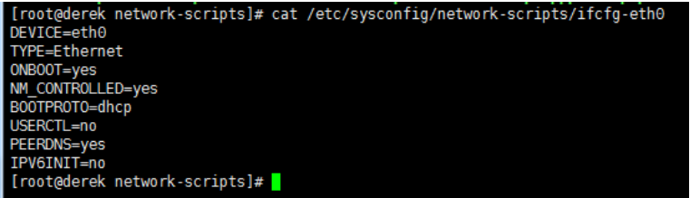

# vmware克隆后操作
右键-->>管理-->>克隆

克隆的系统上网步骤

（1）先setup设置网卡

（2）删除网卡配置的两行

    cat /etc/sysconfig/network-scripts/ifcfg-eth0
    
    
删除HWADDR和UUID这两行

（3）删除70

    > /etc/udev/rules.d/70-persistent-net.rules
    重启后就可以上网了