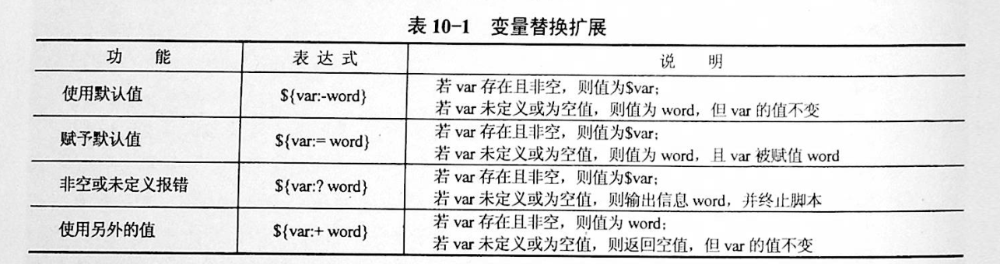
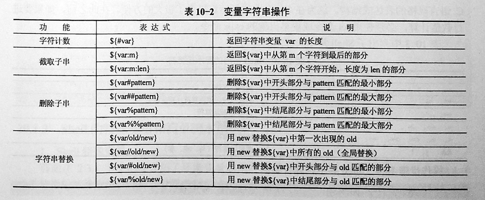

# 二、字符串与数组

## 一、字符串常用操作

#### 1.1 获取字符串长度

利用`${#var}`来获取字符串长度

```
[root@xuel-tmp-shell ~]# var='abcstring'
[root@xuel-tmp-shell ~]# echo ${#var}
9
```

#### 1.2 字符串切片

格式：

${parameter:offset}
${parameter:offset:length}

截取从 offset 个字符开始，向后 length 个字符。

```
[root@xuel-tmp-shell ~]# var="hello shell"
[root@xuel-tmp-shell ~]# echo ${var:0}
hello shell
[root@xuel-tmp-shell ~]# echo ${var:0:5}
hello
[root@xuel-tmp-shell ~]# echo ${var:6:5}
shell
[root@xuel-tmp-shell ~]# echo ${var:(-1)}
l
[root@xuel-tmp-shell ~]# echo ${var:(-2)}
ll
[root@xuel-tmp-shell ~]# echo ${var:(-5):2}
sh

```

#### 1.3 字符串替换

格式：${parameter/pattern/string}
```
${PARAMETER/PATTERN/STRING}
${PARAMETER//PATTERN/STRING} 
${PARAMETER/PATTERN} 
${PARAMETER//PATTERN}
```
``` 
操作符“/”表示只替换一个匹配的字符串，而操作符“//”表示替换所有匹配的字符串。
如果没有指定替换字符串STRING，那么匹配的内容将被替换为空字符串，即被删除。
```

```
[root@xuel-tmp-shell ~]# var="hello shell"
[root@xuel-tmp-shell ~]# echo ${var/shell/world}
hello world

[root@swarm-manager2 Test]# MYSTRING="This is used for replacing string or removing string"
#替换字符串中一个匹配
[root@swarm-manager2 Test]# echo ${MYSTRING/string/characters}
This is used for replacing characters or removing string

##替换所有匹配
[root@swarm-manager2 Test]# echo ${MYSTRING//string/characters}
This is used for replacing characters or removing characters

# 删除一个匹配
[root@swarm-manager2 Test]# echo ${MYSTRING/string/}
This is used for replacing  or removing string

# 删除所有匹配
[root@swarm-manager2 Test]# echo ${MYSTRING//string/}
This is used for replacing  or removing 

```

#### 1.4 字符串删除
``` 
$ hujianli="hello fred，/home/fred, this is test var fred"

# 删除变量中匹配到1次的元素     /元素
$ echo ${hujianli/fred}
hello ，/home/fred, this is test var fred


# 删除变量中开头匹配到的元素   /#元素
$ echo ${hujianli/#fred}
hello fred，/home/fred, this is test var fred

# 删除变量中结尾匹配到的元素    /%元素
$ echo ${hujianli/%fred}
hello fred，/home/fred, this is test var

# 删除变量中所有匹配到的元素     //元素
$ echo ${hujianli//fred}
hello ，/home/, this is test var

```

字符串变量大小写转换
```
$ echo ${hujianli^^}
HELLO FRED，/HOME/FRED, THIS IS TEST VAR FRED

$ echo ${hujianli,,}
hello fred，/home/fred, this is test var fred

```

#### 1.5 字符串截取

格式：

${parameter#word}
\# 删除匹配前缀

${parameter##word}


${parameter%word}
\# 删除匹配后缀

${parameter%%word}

\# 去掉左边，最短匹配模式，##最长匹配模式。

% 去掉右边，最短匹配模式，%%最长匹配模式。

```
[root@xuel-tmp-shell ~]# url="https://www.baidu.com/index.html"
[root@xuel-tmp-shell ~]# echo ${url#*/}
/www.baidu.com/index.html
[root@xuel-tmp-shell ~]# echo ${url##*/}
index.html

[root@xuel-tmp-shell ~]# echo ${url%/*}
https://www.baidu.com
[root@xuel-tmp-shell ~]# echo ${url%%/*}
https:
```

#### 1.6 变量状态赋值

${VAR:-string}	如果 VAR 变量为空则返回 string

${VAR:+string}	如果 VAR 变量不为空则返回 string

${VAR:=string} 如果 VAR 变量为空则重新赋值 VAR 变量值为 string

${VAR:?string} 如果 VAR 变量为空则将 string 输出到 stderr

```
[root@xuel-tmp-shell ~]# url="https://www.baidu.com/index.html"
[root@xuel-tmp-shell ~]# echo ${url:-"string"}
https://www.baidu.com/index.html
[root@xuel-tmp-shell ~]# echo ${url:+"string"}
string
[root@xuel-tmp-shell ~]# unset url
[root@xuel-tmp-shell ~]# echo $url

[root@xuel-tmp-shell ~]# echo ${url:-"string"}
string
[root@xuel-tmp-shell ~]# echo ${url:+"string"}


找出/etc/group下的所有组名称
for i in `cat /etc/group`;do echo ${i%%:*};done

```

### Shell变量操作
##### 1.变量替换扩展


##### 2.变量字符串操作



## 二、数组

bash支持一维数组（不支持多维数组），并且没有限定数组的大小。数组是相同类型的元素按一定顺序排列的集合。
类似与 C 语言，数组元素的下标由 0 开始编号。获取数组中的元素要利用下标，下标可以是整数或算术表达式，其值应大于或等于 0。

#### 2.1 数组定义

在 Shell 中，用括号来表示数组，数组元素用"空格"符号分割开

```
[root@xuel-tmp-shell ~]# args1=(aa bb cc 1123)
[root@xuel-tmp-shell ~]# echo $args1
aa

[root@xuel-tmp-shell ~]# echo ${args1[@]}
aa bb cc 1123
```

#### 2.2 数组元素读取

```
[root@xuel-tmp-shell ~]# args1=(aa bb cc 1123)
[root@xuel-tmp-shell ~]# echo ${#args1[@]}     #获取数组元素个数
4
[root@xuel-tmp-shell ~]# echo ${args1[0]}
aa
[root@xuel-tmp-shell ~]# echo ${args1[1]}
bb

[root@monitor workspace]# filelist=($(ls))
[root@monitor workspace]# echo ${filelist[*]}
check_url_for.sh check_url_while01.sh check_url_while02.sh func01.sh func02.sh func03.sh urllist.txt

获取数组元素的下标
[root@monitor workspace]# echo ${!filelist[@]}
0 1 2 3 4 5 6
```

遍历文件

```
filelist=($(ls));for i in ${!filelist[@]};do echo ${filelist[$i]};done
```

#### 2.3定义关联数组

关联数组必须以大写的declare -A命令来进行声明
``` 
$ declare -A array_example
$ array_example=([0]=centos7 
                 [1]=centos6 
                 [2]=ubuntu   
                 [3]=redhat 
                 [4]=suse 
                 [5]=windows)

$ echo ${array_example[3]}
redhat

$ echo ${array_example[*]}
centos7 centos6 ubuntu redhat suse windows

$ echo ${array_example[@]}
centos7 centos6 ubuntu redhat suse windows

$ echo ${#array_example[@]}
6

# 显示所有的index下标
$ echo ${!array_example[*]}
0 1 2 3 4 5


```

举例说明
```
declare -A projects=(
    [test_chatsrv-frontend]="172.20.20.3"
    [test_chatsrv-core]="172.20.20.5"
    [test_chatsrv-storage]="172.20.20.5"
    [test_chatsrv-push]="172.20.20.5"
)

token="xxxxxxxxx"

for project in ${!projects[@]}; do
    client="${projects[${project}]}"
    curl -w '\n' 'http://deploy.ixiaochuan.cn/deploy' -H "Cookie: remember_token=${token};" --data "operation=update&project=${project}&client=${client}" --compressed --silent
done
```
```
#!/bin/sh
# @Author: hujianli
# @Date:   2018-11-18 15:03:18
# @Last Modified by:   hujianli
# @Last Modified time: 2018-11-18 15:15:13

: <<EOF
符号*是把原数组中的所有元素（除了用于区别元素的分隔符，通常是空格）当成一个元素复制到新数组中，生的新数组只有一个元素
符号@的含义是把原数组的内容复制到一个新数组中，生成的新数组和原来的是一样的
EOF

declare -a      #显示当前所有的数组
declare -ar BASH_VERSION='([0]="2"
                           [1]="05b"
                           [2]="0"
                           [3]="1"
                           [4]="release"
                           [5]="i386-redhat-linux-gnu")'
declare -a DIRSTACK='()'
declare -a GROUPS='()'
declare -a PIPESTATUS='([0]="0")'
declare -a student='([0]="张三"
    [1]="李四"
    [2]="王小二"
    [3]="李晓明"
    [4]="张四宝")'
declare -a score='([0]="66"
    [1]="70"
    [2]="80"
    [3]="90"
    [4]="98")'

echo ${student[@]}
echo ${student[*]}
```
```
#!/bin/sh
# @Author: hujianli
# @Date:   2018-11-18 13:59:12
# @Last Modified by:   hujianli
# @Last Modified time: 2018-11-18 14:04:47
student=("张三" "李四" "王五" "李晓明" "胡建力")
score=(66 70 80 84 99)

N=${#student[*]}        #计算数组的个数总和,赋值给变量N
echo "学生总数为:$N"
i=0
while [[ $i -lt $N ]]; do
    echo -e "\tstudent $[i]的考试成绩为:${score[$i]}"
    i=$(($i+1))
done
```


## 三、字符显示颜色
```
字体颜色           字体背景颜色            显示方式
30：黑	            40：黑
31：红	            41：深红	           0：终端默认设置
32：绿	            42：绿		           1：高亮显示
33：黄	            43：黄色	           4：下划线
34：蓝色            44：蓝色	           5：闪烁
35：紫色            45：紫色	           7：反白显示
36：深绿            46：深绿	           8：隐藏
37：白色            47：白色
格式：
\033[1;31;40m|	# 1 是显示方式，可选。31 是字体颜色。40m 是字体背景颜色。
\033[0m	| # 恢复终端默认颜色，即取消颜色设置。
```

* 显示方式

```
for i in {1..8};do echo -e "\033[$i;31;40m hello world \033[0m";done
```

* 字体颜色

```
for i in {30..37};do echo -e "\033[$i;40m hello world \033[0m";done
```

* 背景颜色

```
for i in {40..47};do echo -e "\033[47;${i}m hello world! \033[0m";done

```


``` 
#!/usr/bin/env bash
#usage:xxx
#scripts_name:xxx.sh
# 文本颜色是由对应的色彩码来描述的。其中包括：重置=0，黑色=30，红色=31，绿色=32，
#  黄色=33，蓝色=34，洋红=35，青色=36，白色=37。
echo -e "\e[1;31m This is red text \e[0m"
echo -e "\e[1;32m This is red text \e[0m"
echo -e "\e[1;33m This is red text \e[0m"
echo -e "\e[1;34m This is red text \e[0m"
echo -e "\e[1;35m This is red text \e[0m"
echo -e "\e[1;36m This is red text \e[0m"
echo -e "\e[1;37m This is red text \e[0m"
echo
echo
#对于彩色背景，经常使用的颜色码是：重置=0，黑色=40，红色=41，绿色=42，黄色=43，
# 蓝色=44，洋红=45，青色=46，白色=47。
echo -e "\e[1;41m Green Background \e[0m"
echo -e "\e[1;42m Green Background \e[0m"
echo -e "\e[1;43m Green Background \e[0m"
echo -e "\e[1;44m Green Background \e[0m"
echo -e "\e[1;45m Green Background \e[0m"
echo -e "\e[1;46m Green Background \e[0m"
echo -e "\e[1;47m Green Background \e[0m"


#定义一个颜色的函数
echo_color (){
    local color=$1
    local info=$2
    case "$color" in
    red)
        echo -e "\e[1;31m ${info} \e[0m"
       ;;
    green)
        echo -e "\e[1;32m ${info} \e[0m"
       ;;
    yellow)
        echo -e "\e[1;33m ${info} \e[0m"
       ;;
    blue)
        echo -e "\e[1;34m ${info} \e[0m"
       ;;
    Magenta)
        echo -e "\e[1;35m ${info} \e[0m"
    ;;
    cyan-blue)
        echo -e "\e[1;36m ${info} \e[0m"
    ;;
    esac

}
echo_color red "哈哈哈哈哈哈哈"
echo_color green "哈哈哈哈哈哈哈"
echo_color yellow "哈哈哈哈哈哈哈"
echo_color blue "哈哈哈哈哈哈"
echo_color Magenta "哈哈哈哈哈哈"


```