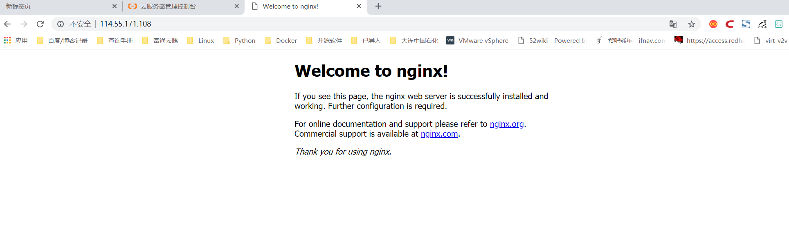

# nginx入门简介
Nginx ("engine x") 是一个高性能的 HTTP 和 反向代理 服务器，也是一个 IMAP/POP3/SMTP 代理服务器，目前中国互联网企业70%以上公司都在使用nginx作为自己的web服务器。


    Nginx特点是占有内存少，并发能力强，事实上nginx的并发能力确实在同类型的网页服务器中表现较好。

## 一：Nginx相对于Apache优点：

    1)     高并发响应性能非常好，官方Nginx处理静态文件并发5w/s
    
    2)     反向代理性能非常强。（可用于负载均衡）
    
    3)     内存和cpu占用率低。（为Apache的1/5-1/10）
    
    4)     对后端服务有健康检查功能。
    
    5)     支持PHP cgi方式和fastcgi方式。
    
    6)     配置代码简洁且容易上手。

## 二：nginx的模块

    ① 核心模块：HTTP模块、EVENT模块和MAIL模块
    
    ② 基础模块：HTTP Access模块、HTTP FastCGI模块、HTTP Proxy模块和HTTP Rewrite模块，
    
    ③ 第三方模块：HTTP Upstream Request Hash模块、Notice模块和HTTP Access Key模块

## 三：nginx的安装
注意：首先需要安装pcre库，安装pcre支持rewrite库,也可以安装源码，注*安装源码时，指定pcre路径为解压源码的路径，而不是编译后的路径，否则会报错。
    
    yum install vim gcc telnet lrzsz openssl openssl-devel pcre pcre-devel

下载Nginx源码包
     
     wget -c http://nginx.org/download/nginx-1.12.0.tar.gz 

创建nginx用户，并且设置为不能登录

    useradd -r -s /sbin/nologin nginx 

解压，进入解压目录，然后sed修改Nginx版本信息为JSW

    tar zxvf nginx-1.12.0.tar.gz 
    cd nginx-1.12.0;sed -i -e 's/1.12.0//g' -e 's/nginx\//JWS/g' -e 's/"NGINX"/"JWS"/g' src/core/nginx.h

编译，预编译nginx
    
    useradd www;./configure --user=www --group=www --prefix=/usr/local/nginx/ --with-http_stub_status_module --with-http_ssl_module && make && make install

至此nginx web服务安装完毕

检查nginx配置文件是否正确，返回OK即正确。

    [root@iZbp13qhd2a20s0a3p6qzxZ nginx-1.12.0]# /usr/local/nginx/sbin/nginx -t
    nginx: the configuration file /usr/local/nginx//conf/nginx.conf syntax is ok
    nginx: configuration file /usr/local/nginx//conf/nginx.conf test is successful
    
    将nginx加入到环境变量中，开机自动加载
    echo "export PATH=$PATH:/usr/local/nginx/sbin/" >> /etc/profile

启动nginx

    [root@iZbp13qhd2a20s0a3p6qzxZ nginx-1.12.0]# /usr/local/nginx/sbin/nginx
    [root@iZbp13qhd2a20s0a3p6qzxZ nginx-1.12.0]# ps aux | grep nginx
    root     10952  0.0  0.0  45932  1120 ?        Ss   23:28   0:00 nginx: master process /usr/local/nginx/sbin/nginx
    www      10953  0.0  0.0  46380  1896 ?        S    23:28   0:00 nginx: worker process
    root     10961  0.0  0.0 112708   980 pts/0    S+   23:28   0:00 grep --color=auto nginx




## 四：yum安装nginx

环境 Centos 7 

安装步骤
```
1.添加Nginx到YUM源
sudo rpm -Uvh http://nginx.org/packages/centos/7/noarch/RPMS/nginx-release-centos-7-0.el7.ngx.noarch.rpm
或者
sudo yum install epel-release

2.安装Nginx
sudo yum install -y nginx

3.启动Nginx
sudo systemctl start nginx.service

#CentOS 7 开机启动Nginx
sudo systemctl enable nginx.service


Nginx配置信息
* 网站文件存放默认目录        /usr/share/nginx/html
* 网站默认站点配置            /etc/nginx/conf.d/default.conf
* 自定义Nginx站点配置文件存放目录    /etc/nginx/conf.d/
* Nginx全局配置                     /etc/nginx/nginx.conf
* Nginx启动                           nginx -c nginx.conf
```
参考文献
https://blog.51cto.com/3241766/2094315


易百教程Nginx专题
https://www.yiibai.com/nginx/nginx-install.html


​    