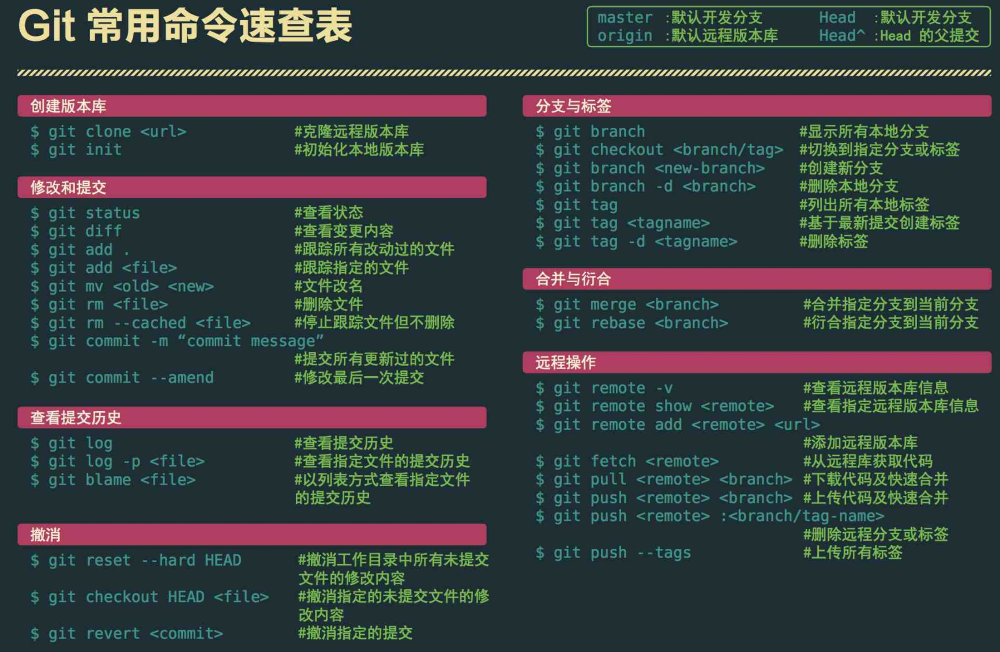

# Git仓库的使用

## 安装git
``` 
$ sudo yum install git-all          #Centos7
$ sudo apt-get install git-all      #Ubuntu
```

## 创建新的 git 仓库
``` 
$ mkdirMyProject
$ cdMyProject
$ git init


# 如果你想让远程用户也能够访问这个仓库，需要使用 update-server-info 命令：
$ git update-server-info

```

## 克隆远程 git 仓库
git clone 命令可以将文件从远程站点复制到本地系统中。远程站点可以是匿名仓库（如GitHub），也可以是需要用户名和密码登录的系统。
```
从已知的远程站点（如GitHub）克隆：
$ git clone http://github.com/ProjectName


从需要用户名和密码的站点（可能是你自己的服务器）克隆：
$ git clone clif@172.16.183.130:gitTest
```

## 使用 git 添加与提交变更
``` 
git add 命令可以将工作代码（working code）中的变更添加到暂存区。该命令并不会改变仓库内容，它只是标记出此次变更，将其加入下一次提交中：

$ vim SomeFile.sh
$ git add SomeFile.sh

如果你希望在提交所有变更的时候不会遗漏某一个，最好在每次编辑之后都执行 git add 。
$ echo "my test file" >testfile.txt
$ git add testfile.txt

也可以一次添加多个文件：
$ git add *.c

git commit 命令可以将变更提交至仓库：
$ vim OtherFile.sh
$ git add OtherFile.sh
$ git commit


以利用 -a 和 -m 选项缩短add/commit操作的输入。
  -a ：在提交前加入新的代码。
  -m ：指定一条信息，不进入编辑器。
git commit -am "Add and Commit all modified files."
```

## 使用 git 创建与合并分支
``` 
切换到之前创建的分支：
$ git checkout OldBranchName

可以使用 checkout 的选项 -b 来创建新的分支：
$ git checkout -b MyBranchName
Switched to a new branch 'MyBranchName'

该命令将当前工作分支定义为 MyBrachName 。它将 MyBrachName 的指针指向前一个分支。随着
变更的添加和提交，该指针会离最初的分支越来越远。


git branch 命令可以查看分支：
$ git branch

* MyBranchName
master
当前分支由星号（*）着重标出。

```

## 实战演练
``` 
创建了新分支，添加并提交过变更之后，切换回起始分支，然后使用 git merge 命令将变更合并入新分支：

$ git checkout originalBranch
$ git checkout -b modsToOriginalBranch
#  编辑，测试
$ git commit -a -m "Comment on modifications to originalBranch"
$ git checkout originalBranch
$ git merge modsToOriginalBranch


(2) 工作原理
第一个 git checkout 命令检索起始分支的快照。第二个 git checkout 命令将当前的工作
代码标记为新的分支。
git commit 命令移动新分支的快照指针，使其远离起始分支。第三个 git checkout 命令
将代码恢复到进行编辑和提交之前的初始状态。
git merge 命令将起始分支的快照指针移动至正在合并的分支快照。


(3) 补充内容
如果合并完分支之后不再需要该分支，可以使用选项 -d 进行删除：
$ git branch -d MyBranchName
```


## Git常用操作查询图1



## Git常用操作查询图2
